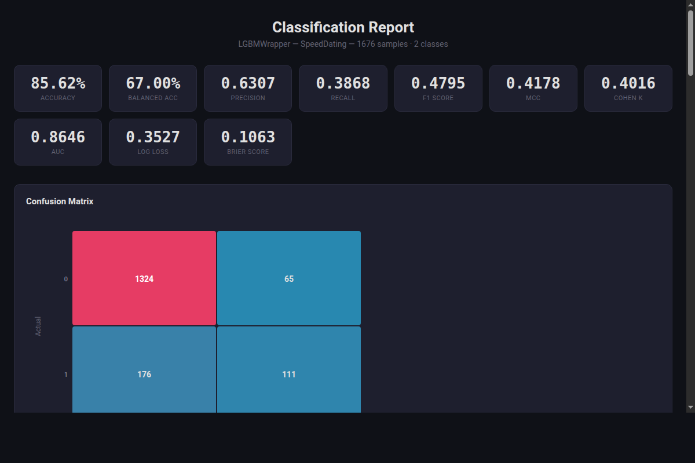

<p align="center">
  <h1 align="center">Endgame</h1>
  <p align="center">
    <strong>Production-aware machine learning under the scikit-learn API</strong>
  </p>
  <p align="center">
    Calibrated probabilities &middot; Interpretable models &middot; Deployment guardrails &middot; Agent-ready via MCP
  </p>
  <p align="center">
    <a href="https://pypi.org/project/endgame-ml/"></a>
    <a href="https://pepy.tech/project/endgame-ml"></a>
    <a href="https://github.com/allianceai/endgame/actions"></a>
    <a href="https://codecov.io/gh/allianceai/endgame"></a>
    <a href="https://github.com/astral-sh/ruff"></a>
    <a href="https://github.com/allianceai/endgame/blob/main/LICENSE"></a>
    <a href="https://www.python.org/downloads/"></a>
    <a href="https://colab.research.google.com/github/allianceai/endgame/blob/main/examples/colab_quickstart.ipynb"></a>
    <a href="https://github.com/allianceai/endgame/stargazers"></a>
  </p>
  <p align="center">
    <a href="#quick-start">Quick Start</a> &middot;
    <a href="#why-endgame">Why Endgame</a> &middot;
    <a href="#agent-ready-build-ml-pipelines-with-ai">MCP</a> &middot;
    <a href="#benchmark-results">Benchmarks</a> &middot;
    <a href="#installation">Installation</a> &middot;
    <a href="#modules">Modules</a> &middot;
    <a href="https://endgame-ml.readthedocs.io">Documentation</a>
  </p>
</p>

---

> *Machine learning shouldn't stop at accuracy. Models must be calibrated, interpretable, and deployable by design.*

## TL;DR

Endgame is a production-aware ML framework built for high-stakes domains where interpretability and calibration are non-negotiable. It powers clinical analytics at the Michael J. Fox Foundation and production ML infrastructure at Alliance AI.

- **Battle-tested in clinical ML** --- Used in clinical analytics at the Michael J. Fox Foundation through the Parkinson's Insight Engine [PIE](https://github.com/MJFF-ResearchCommunity/PIE/tree/main/pie)
- **Natively agent-ready** --- one of the first ML frameworks with a built-in [MCP](docs/guides/mcp_server.md) server, letting AI agents build, evaluate, and deploy pipelines through natural language
- **Extends scikit-learn** with calibrated, interpretable models across every major family
- **Adds deployment guardrails** --- conformal prediction, leakage detection, latency constraints
- **Provides unified benchmarking** --- glass-box models match GBDT accuracy while remaining fully auditable

```bash
pip install endgame-ml[tabular]
```

```python
import endgame as eg
from sklearn.datasets import fetch_openml
from sklearn.model_selection import train_test_split

# "What predicts a match?" --- 8,378 speed dates, 120 features
X, y = fetch_openml(data_id=40536, return_X_y=True, as_frame=True, parser="auto")
X_train, X_test, y_train, y_test = train_test_split(X, y, test_size=0.2, random_state=42)

result = eg.quick.classify(X_train, y_train, preset="default")
result.report(X_test, y_test, save_path="report.html", dataset_name="SpeedDating")
```

<p align="center">
  <a href="https://allianceai.github.io/endgame/speeddating_report.html">
    
  </a>
</p>
<p align="center">
  <strong><a href="https://allianceai.github.io/endgame/speeddating_report.html">Open the full interactive report &rarr;</a></strong>
</p>

## Why Endgame

Most ML libraries optimize for leaderboard accuracy. Endgame optimizes for **deployment integrity** --- calibrated probabilities, interpretable models, and guardrails against leakage --- all under the scikit-learn API you already know.

Extracted from production systems in financial ML, healthcare modeling, and competition pipelines, the framework consolidates SOTA deep tabular models, competition-winning ensemble techniques, uncommon methods like Bayesian network classifiers, rule learners, and symbolic regression, and rigorous tools like conformal prediction and Venn-ABERS calibration under a single, tested API.

Every estimator is a scikit-learn estimator. If you know `fit` and `predict`, you already know Endgame.

```
Data -> Validation -> Preprocessing -> Models -> Ensemble -> Calibration -> Deploy
                                        |
                          Vision / NLP / Audio / Signal / TimeSeries
```

### Used By

- **[PIE](https://github.com/MJFF-ResearchCommunity/PIE/tree/main/pie)** --- Parkinson's Insight Engine (Michael J. Fox Foundation)
- **[Alliance AI](https://github.com/allianceai)** --- Production ML infrastructure

Built and maintained by [Cameron Hamilton](https://github.com/allianceai). Several novel methods developed alongside Endgame are currently under peer review and will be integrated upon publication.

## Agent-Ready: Build ML Pipelines with AI

Endgame's built-in [Model Context Protocol](docs/guides/mcp_server.md) (MCP) server turns any compatible AI agent --- Claude Code, Claude Desktop, VS Code Copilot --- into a full ML engineering assistant. The agent can load data from any source, discover and train models, evaluate performance, generate explanations, and export reproducible scripts.

<!-- GIF of MCP agent session will be added here -->
<!-- <p align="center"></p> -->

**Quick start** --- train, evaluate, and export in one conversation:

```
You: Load the German Credit dataset and build me the best classifier you can.

Agent -> load_data(source="openml:credit-g", target_column="class")
      -> recommend_models(dataset_id="ds_a1b2c3d4", time_budget="medium")
      -> train_model(dataset_id="ds_a1b2c3d4", model_name="lgbm")
      -> train_model(dataset_id="ds_a1b2c3d4", model_name="xgb")
      -> evaluate_model(model_id="model_e5f6g7h8")
      -> create_report(model_id="model_e5f6g7h8")
      -> export_script(model_id="model_e5f6g7h8")
```

Setup takes one line in your project:

```json
// .mcp.json
{
  "mcpServers": {
    "endgame": {
      "command": "python",
      "args": ["-m", "endgame.mcp"]
    }
  }
}
```

<details>
<summary><strong>Example: Competition-style model bakeoff with preprocessing</strong></summary>

```
You: I have a messy healthcare dataset with missing values and class imbalance.
     Clean it up, compare interpretable models, and give me the best one
     with a full explanation of what's driving predictions.

Agent -> load_data(source="patient_outcomes.csv", target_column="readmitted")
      -> inspect_data(dataset_id="ds_...", operation="summary")
      -> inspect_data(dataset_id="ds_...", operation="missing")
      -> preprocess(dataset_id="ds_...", operations=[
           {"type": "impute", "strategy": "median"},
           {"type": "encode", "method": "target"},
           {"type": "balance", "method": "smote"},
           {"type": "select_features", "method": "mutual_info", "top_k": 20}
         ])
      -> split_data(dataset_id="ds_...", test_size=0.2, stratify=true)
      -> train_model(dataset_id="ds_train_...", model_name="ebm")
      -> train_model(dataset_id="ds_train_...", model_name="catboost")
      -> train_model(dataset_id="ds_train_...", model_name="tabpfn")
      -> evaluate_model(model_id="model_ebm_...", dataset_id="ds_test_...")
      -> evaluate_model(model_id="model_cat_...", dataset_id="ds_test_...")
      -> evaluate_model(model_id="model_pfn_...", dataset_id="ds_test_...")
      -> explain_model(model_id="model_ebm_...", method="permutation", top_n=15)
      -> create_visualization(chart_type="roc_curve", model_id="model_ebm_...", dataset_id="ds_test_...")
      -> create_visualization(chart_type="calibration_plot", model_id="model_ebm_...", dataset_id="ds_test_...")
      -> create_report(model_id="model_ebm_...")
      -> export_script(model_id="model_ebm_...", include_preprocessing=true)

Agent: EBM wins (AUC 0.847, ECE 0.012) --- fully interpretable with well-calibrated
       probabilities. Top drivers: prior_emergency_visits (+0.31), discharge_disposition
       (+0.24), num_medications (+0.18). Full report saved to evaluation_report.html.
       Standalone Python script exported to pipeline_ebm.py.
```
</details>

<details>
<summary><strong>Example: End-to-end AutoML with deployment constraints</strong></summary>

```
You: I need a production fraud detection model. Run AutoML with the best
     quality preset, explain the results, and give me everything I need to deploy.

Agent -> load_data(source="transactions.parquet", target_column="is_fraud")
      -> inspect_data(dataset_id="ds_...", operation="describe")
      -> inspect_data(dataset_id="ds_...", operation="distribution", column="is_fraud")
      -> automl(dataset_id="ds_...", preset="best_quality", time_limit=3600)
      -> evaluate_model(model_id="model_...", metrics="roc_auc,f1,precision,recall,matthews_corrcoef")
      -> explain_model(model_id="model_...", method="permutation", top_n=20)
      -> create_visualization(chart_type="pr_curve", model_id="model_...", dataset_id="ds_...")
      -> create_visualization(chart_type="lift_chart", model_id="model_...", dataset_id="ds_...")
      -> create_visualization(chart_type="confusion_matrix", model_id="model_...", dataset_id="ds_...")
      -> create_report(model_id="model_...", report_type="classification")
      -> save_model(model_id="model_...")
      -> export_script(model_id="model_...", include_preprocessing=true)

Agent: AutoML trained 12 models in 48 min. Best: CatBoost ensemble (AUC 0.964,
       precision 0.91 at 0.85 recall). Top fraud signals: transaction_velocity,
       merchant_category_mismatch, amount_zscore. Model saved to fraud_model.egm,
       deployment script at pipeline_catboost.py, full report at evaluation_report.html.
```
</details>

<details>
<summary><strong>Example: Anomaly detection + clustering</strong></summary>

```
You: I have IoT sensor data with no labels. Find anomalies, segment the data
     into operational modes, and visualize everything.

Agent -> load_data(source="sensor_readings.csv", target_column="temperature")
      -> inspect_data(dataset_id="ds_...", operation="summary")
      -> detect_anomalies(dataset_id="ds_...", method="isolation_forest", contamination=0.02)
      -> cluster(dataset_id="ds_clean_...", method="hdbscan")
      -> create_visualization(chart_type="scatterplot", dataset_id="ds_clustered_...",
           params={"x": "pressure", "y": "temperature"}, title="Operational Modes")

Agent: Found 847 anomalies (2.1%). HDBSCAN identified 4 operational modes: idle (38%),
       normal load (31%), high load (24%), and startup transient (7%).
```
</details>

See the [MCP Server Guide](docs/guides/mcp_server.md) for full documentation.

## Quick Start

### Train and evaluate a model

```python
import endgame as eg
from sklearn.datasets import fetch_openml
from sklearn.model_selection import train_test_split

# Load data
credit = fetch_openml(data_id=31, as_frame=False, parser="auto")
X_train, X_test, y_train, y_test = train_test_split(
    credit.data, credit.target, test_size=0.3, random_state=42
)

# Train with competition-winning defaults
model = eg.models.LGBMWrapper(preset="endgame")
model.fit(X_train, y_train)
print(f"Accuracy: {model.score(X_test, y_test):.4f}")
```

### AutoML with guardrails and deployment constraints

```python
from endgame.automl import TabularPredictor, DeploymentConstraints

predictor = TabularPredictor(
    label="target",
    presets="good_quality",
    guardrails_strict=True,  # Abort on target leakage or critical data issues
    constraints=DeploymentConstraints(max_predict_latency_ms=10.0),
)
predictor.fit(train_df, time_limit=3600)

predictions = predictor.predict(test_df)
report = predictor.report()       # Full performance report
explanations = predictor.explain() # SHAP feature importances
```

### Generate a full evaluation report

```python
from endgame.visualization import ClassificationReport

report = ClassificationReport(
    model, X_test, y_test,
    feature_names=credit.feature_names,
    model_name="LightGBM",
    dataset_name="German Credit",
)
report.save("evaluation_report.html")
```

Self-contained HTML with metrics, confusion matrix, ROC curve, precision-recall curve, calibration plot, feature importances, and prediction histograms.

### Build an optimized ensemble

```python
from endgame.ensemble import SuperLearner
from sklearn.linear_model import LogisticRegression
from sklearn.ensemble import RandomForestClassifier

sl = SuperLearner(
    base_estimators=[
        ("lgbm", eg.models.LGBMWrapper(preset="endgame")),
        ("xgb", eg.models.XGBWrapper(preset="endgame")),
        ("rf", RandomForestClassifier(n_estimators=200)),
        ("lr", LogisticRegression(max_iter=1000)),
    ],
    meta_learner="nnls",  # non-negative least squares (convex combination)
    cv=5,
)
sl.fit(X_train, y_train)
print(f"Super Learner weights: {dict(zip([n for n,_ in sl.base_estimators], sl.coef_))}")
```

### Interpretable models for regulated domains

```python
from endgame.models import EBMClassifier
from endgame.models.interpretable import (
    GOSDTClassifier,      # Provably optimal sparse decision trees
    CORELSClassifier,     # Certifiably optimal rule lists
    SLIMClassifier,       # Integer risk scorecards
    GAMClassifier,        # Smooth shape functions
)

# Glass-box boosting with automatic interactions
ebm = EBMClassifier(interactions=10)
ebm.fit(X_train, y_train)
print(f"Accuracy: {ebm.score(X_test, y_test):.4f}")
ebm.explain_global()  # Per-feature shape functions
ebm.explain_local(X_test[:1])  # Per-prediction breakdown

# Hand-scoreable risk scorecard (no computer needed)
slim = SLIMClassifier(max_coef=5)
slim.fit(X_train, y_train)
print(slim.get_scorecard())
# age > 50:    +2
# income < 30k: +3
# employed:    -1
# intercept:   -2
# Score >= 3 -> high risk
```

## What You Get

- **Calibrated, interpretable, sklearn-compatible.** Estimators spanning every major model family --- GBDTs, deep tabular architectures, Bayesian classifiers, rule learners, kernel methods, and a broad suite of glass-box models --- with conformal prediction, Venn-ABERS calibration, and deployment guardrails built in.

- **Agent-ready architecture.** Ships a [Model Context Protocol](docs/guides/mcp_server.md) (MCP) server that lets AI agents build reliable, state-of-the-art ML pipelines through natural language. Load any dataset, train and compare models, evaluate, explain, and export reproducible Python scripts --- with a compact tool schema that fits in under 2K tokens.

- **Depth, not just breadth.** Conformal prediction with finite-sample coverage guarantees. Cross-validation strategies including combinatorial purged CV for finance. Adversarial validation for drift detection. Self-contained interactive HTML visualizations.

- **Ensembles that win.** Super Learner with NNLS-optimal weighting. Bayesian Model Averaging. Negative Correlation Learning. Cascade ensembles with early exit. Hill climbing. Optuna-optimized blending.

- **Full AutoML.** Multi-stage pipeline: profiling, quality guardrails, preprocessing, feature engineering, model selection, training, constraint checking, HPO, ensembling, threshold optimization, calibration, and explainability. Time-budgeted with dynamic reallocation.

<p align="center">
  
</p>
<p align="center"><em>AutoML pipeline architecture: quality guardrails, iterative search, ensembling, and explainability.</em></p>

- **Domain modules.** Dedicated modules for time series (statistical + neural forecasting, ROCKET classification), signal processing (filtering, spectral, wavelets, entropy, complexity), vision, NLP, and audio --- all with the same `fit`/`predict` interface.

- **No lock-in.** Every estimator is a scikit-learn estimator. Your existing code works. Your existing pipelines work. Endgame adds to your toolkit --- it doesn't replace it.

## Benchmark Results

### Classification (19 datasets from Grinsztajn NeurIPS 2022 suite)

| Rank | Model | Family | Acc | Brier | ECE |
|---|---|---|---|---|---|
| 1 | TabPFN | Foundation | 0.783 | 0.143 | 0.015 |
| 2 | CatBoost | GBDT | 0.768 | 0.153 | 0.021 |
| 3 | EBM | Glass-box | 0.768 | 0.153 | 0.015 |
| 4 | GradientBoosting | GBDT | 0.767 | 0.154 | 0.019 |
| 5 | RandomForest | Ensemble | 0.766 | 0.158 | 0.046 |
| 6 | XGBoost | GBDT | 0.764 | 0.171 | 0.111 |
| 7 | LightGBM | GBDT | 0.764 | 0.185 | 0.147 |
| 8 | ObliqueRF | Trees | 0.762 | 0.158 | 0.040 |
| 9 | ExtraTrees | Ensemble | 0.762 | 0.163 | 0.055 |
| 10 | RuleFit | Glass-box | 0.756 | 0.164 | 0.047 |

### Regression (28 datasets)

| Rank | Model | Family | R² |
|---|---|---|---|
| 1 | TabPFN | Foundation | 0.678 |
| 2 | CatBoost | GBDT | 0.657 |
| 3 | EBM | Glass-box | 0.650 |
| 4 | GradientBoosting | GBDT | 0.648 |
| 5 | RuleFit | Glass-box | 0.644 |
| 6 | FTTransformer | Deep Tabular | 0.643 |
| 7 | RandomForest | Ensemble | 0.638 |
| 8 | XGBoost | GBDT | 0.622 |
| 9 | LightGBM | GBDT | 0.616 |
| 10 | MARS | Glass-box | 0.598 |

> **Stop sacrificing accuracy for interpretability.** EBM (a fully auditable glass-box model) ties CatBoost at 0.768 accuracy across 19 datasets --- with *better* calibration (ECE 0.015 vs 0.021). You don't have to choose between performance and explainability.

### Calibration

> **Calibration reduces ECE by 26%.** Across 19 datasets and 3 base models, post-hoc calibration (histogram binning, temperature scaling, Venn-ABERS) reduces Expected Calibration Error from 0.042 to 0.031. Conformal prediction achieves 95.3% coverage at the 95% target.

### Reproducibility

Every benchmark is fully reproducible. Endgame enforces strict seed control across all wrapped estimators, including deep tabular and GPU-accelerated GBDTs.

```bash
python benchmarks/run_tabular_benchmark.py
```

<details>
<summary>Full benchmark methodology</summary>

- **Datasets:** Grinsztajn NeurIPS 2022 benchmark suite --- 47 datasets (19 classification, 28 regression)
- **Reference:** "Why do tree-based models still outperform deep learning on typical tabular data?" (NeurIPS 2022)
- **Models:** 74 models from 12 families
- **Protocol:** 5-fold StratifiedKFold, max 5000 samples, 600s timeout per model
- **Metrics:** Accuracy, balanced accuracy, F1 (weighted), ROC-AUC, Brier score, log loss, ECE

See `benchmarks/README.md` for full reproduction instructions.

</details>

## Installation

```bash
# Core (numpy, polars, scikit-learn, optuna)
pip install endgame-ml

# With gradient boosting + deep tabular models
pip install endgame-ml[tabular]

# Full installation (all domains)
pip install endgame-ml[all]
```

<details>
<summary>Optional dependency groups</summary>

| Group | Includes |
|---|---|
| `tabular` | XGBoost, LightGBM, CatBoost, PyTorch, EBM, TabPFN |
| `vision` | timm, albumentations, segmentation-models-pytorch |
| `nlp` | Transformers, tokenizers, bitsandbytes |
| `audio` | librosa, torchaudio |
| `benchmark` | OpenML, pymfe |
| `calibration` | scipy |
| `explain` | SHAP, LIME, DiCE |
| `fairness` | fairlearn |
| `deployment` | ONNX, ONNX Runtime, skl2onnx, hummingbird-ml |
| `tracking` | MLflow experiment tracking |
| `mcp` | MCP server for LLM integration |
| `all` | Everything above |
| `dev` | pytest, ruff, mypy |

</details>

## Modules

Endgame is organized into 26 modules following the ML workflow:

### Core Modeling

| Module | Description | Key Classes |
|---|---|---|
| `eg.models` | 100+ estimators: GBDTs, deep tabular, trees, rules, Bayesian, kernel, neural, baselines | `LGBMWrapper`, `FTTransformerClassifier`, `RotationForestClassifier`, `TANClassifier` |
| `eg.models.interpretable` | 30+ glass-box models: EBM, GAM, GAMI-Net, NODE-GAM, NAM, CORELS, GOSDT, SLIM, FasterRisk, PySR | `EBMClassifier`, `GAMClassifier`, `GOSDTClassifier`, `CORELSClassifier`, `SLIMClassifier` |
| `eg.ensemble` | Ensemble methods: voting, bagging, boosting, stacking, Super Learner, BMA, NCL, cascades | `SuperLearner`, `VotingClassifier`, `AdaBoostClassifier`, `CascadeEnsemble` |
| `eg.calibration` | Conformal prediction, Venn-ABERS, temperature/Platt/beta/isotonic scaling | `ConformalClassifier`, `VennABERS`, `TemperatureScaling` |
| `eg.tune` | Optuna integration with domain-specific search spaces | `OptunaOptimizer` |

### Data & Features

| Module | Description | Key Classes |
|---|---|---|
| `eg.preprocessing` | 45+ transformers: encoding, imputation, aggregation, imbalanced learning (25 samplers), noise detection | `SafeTargetEncoder`, `AutoAggregator`, `MissForestImputer`, `SMOTEResampler` |
| `eg.validation` | 8 CV strategies, adversarial validation, drift detection | `PurgedTimeSeriesSplit`, `CombinatorialPurgedKFold`, `AdversarialValidator` |
| `eg.anomaly` | Isolation Forest, LOF, GritBot, PyOD (39+ algorithms) | `IsolationForestDetector`, `GritBotDetector`, `PyODDetector` |
| `eg.semi_supervised` | Self-training for classification and regression | `SelfTrainingClassifier`, `SelfTrainingRegressor` |

### Domain-Specific

| Module | Description | Key Classes |
|---|---|---|
| `eg.timeseries` | Statistical + neural forecasting, ROCKET/HYDRA classification | `AutoARIMAForecaster`, `NBEATSForecaster`, `MiniRocketClassifier` |
| `eg.signal` | 40+ transforms: filtering, spectral analysis, wavelets, entropy, complexity, spatial | `ButterworthFilter`, `WelchPSD`, `CSP`, `PermutationEntropy` |
| `eg.vision` | timm backbones, TTA, WBF, segmentation, augmentation pipelines | `VisionBackbone`, `WeightedBoxesFusion` |
| `eg.nlp` | Transformers, DAPT, pseudo-labeling, back-translation, LLM utilities | `TransformerClassifier`, `DomainAdaptivePretrainer` |
| `eg.audio` | Spectrograms, PCEN, sound event detection, audio augmentation | `SEDModel`, `SpectrogramTransformer` |

### Analysis & Infrastructure

| Module | Description |
|---|---|
| `eg.automl` | Full AutoML: 15-stage pipeline with quality guardrails, HPO, constraint checking, explainability |
| `eg.visualization` | 42 interactive chart types + model reports, all self-contained HTML |
| `eg.tracking` | Experiment tracking: MLflow, console logger, abstract interface |
| `eg.mcp` | MCP server: 20 tools + 6 resources for LLM-powered ML pipelines |
| `eg.explain` | SHAP, LIME, PDP, feature interactions, counterfactuals |
| `eg.fairness` | Fairness metrics, bias mitigation, HTML reports |
| `eg.benchmark` | OpenML suite loading, meta-learning, learning curves |
| `eg.quick` | One-line model training and comparison |
| `eg.persistence` | Model save/load, ONNX export, model serving |
| `eg.kaggle` | Competition management, submissions, project scaffolding |

## How Endgame Extends the Ecosystem

Endgame is fully scikit-learn compatible --- it adds to your toolkit rather than replacing it.

| Capability | Endgame | scikit-learn | AutoGluon | PyCaret |
|---|---|---|---|---|
| Sklearn-compatible API | Yes | Yes | Partial | Partial |
| Deep tabular models | 15+ (FT-Transformer, SAINT, TabPFN, ...) | --- | 9+ | --- |
| Conformal prediction | Classification + regression | --- | Partial | --- |
| Signal processing | 40+ transforms | --- | --- | --- |
| Time series classification (ROCKET) | Yes | --- | --- | --- |
| Interactive visualizations | 42 self-contained HTML types | --- | Moderate | Limited |
| Ensemble optimization (Super Learner, BMA) | Yes | Basic | Yes | Basic |
| Imbalanced learning | 25 samplers | --- | Basic | Yes |
| Interpretable models (EBM, GAM, CORELS, GOSDT, SLIM) | 30+ | --- | Partial | --- |
| Custom tree algorithms (Rotation Forest, C5.0) | Yes | --- | --- | --- |
| Production guardrails (leakage, drift, constraints) | Yes | --- | --- | --- |
| Experiment tracking (MLflow) | Yes | --- | --- | Yes |
| AutoML with deployment constraints | Yes | --- | --- | --- |
| LLM agent integration (MCP) | Native MCP server (20 tools) | --- | Yes | --- |

## Design Principles

1. **Sklearn interface everywhere.** Every estimator implements `fit`/`predict`/`transform`. No proprietary APIs to learn. Works inside `Pipeline`, `GridSearchCV`, `cross_val_score`.

2. **Polars-first preprocessing.** Tabular transformations use `pl.LazyFrame` internally for speed and memory efficiency, while accepting pandas/numpy input transparently.

3. **Explicit over implicit.** No magic. Every technique requires explicit invocation. You control the pipeline, the features, the ensemble, the calibration.

4. **Depth over convenience.** Conformal prediction sets, calibration curves, decision rules, feature importances --- these are first-class citizens, not afterthoughts.

5. **Production-aware defaults.** Quality guardrails catch target leakage and data drift before training starts. Deployment constraints enforce latency and model size limits. Calibration ensures predicted probabilities mean something.

6. **Self-contained outputs.** Every visualization generates a standalone HTML file with all CSS and JavaScript inlined. No CDN dependencies, no network required. Open it anywhere, share it with anyone.

7. **Standardized guardrails, not just wrappers.** Endgame isn't importing models and re-exporting them. It enforces a unified contract for conformal prediction, probability calibration, and latency constraints across architectures that normally don't talk to each other --- PyTorch deep tabular models, C5.0 trees, Bayesian networks, and GBDTs all get the same deployment-ready interface.

## When Endgame May Not Be the Right Tool

- **Large-scale distributed training** --- if you need multi-node GPU training or petabyte-scale data, use Ray, Spark MLlib, or H2O. Endgame runs on a single machine.
- **Pure deep learning research** --- if you're designing novel architectures or need fine-grained control over training loops, use PyTorch or JAX directly. Endgame wraps these frameworks but doesn't expose their full flexibility.
- **Deep domain specialization** --- for production NLP pipelines, use spaCy or HuggingFace directly. For object detection, use Detectron2 or MMDetection. Endgame's domain modules provide useful wrappers but don't match the feature depth of dedicated frameworks.

## Roadmap

Endgame is under active development. Upcoming work includes:

- Integration of novel research methods (currently under peer review) for tabular learning and data augmentation
- Expanded AutoML search strategies and meta-learning
- Additional domain-specific predictors (multimodal, geospatial)
- Documentation site and tutorials

See [ROADMAP.md](ROADMAP.md) for the full implementation status.

<details>
<summary>Project structure</summary>

```
endgame/
├── core/              # Base classes, Polars ops, config, types
├── models/            # 100+ estimators across 12 submodules
│   ├── wrappers.py    #   GBDT wrappers (LightGBM, XGBoost, CatBoost)
│   ├── tabular/       #   Deep tabular (FT-Transformer, SAINT, NODE, ...)
│   ├── trees/         #   Custom trees (Rotation Forest, C5.0, Oblique)
│   ├── bayesian/      #   Bayesian classifiers (TAN, KDB, ESKDB)
│   ├── rules/         #   Rule learners (RuleFit, FURIA)
│   ├── interpretable/ #   EBM, GAM, GAMI-Net, NODE-GAM, CORELS, GOSDT, SLIM, FasterRisk
│   ├── neural/        #   MLP, EmbeddingMLP, TabNet
│   ├── kernel/        #   GP, SVM
│   ├── baselines/     #   ELM, NaiveBayes, LDA/QDA, KNN, Linear
│   └── probabilistic/ #   BART, NGBoost
├── ensemble/          # Ensemble methods
├── calibration/       # Conformal prediction, probability calibration
├── preprocessing/     # 45+ transformers
├── validation/        # 8 CV strategies, adversarial validation
├── visualization/     # 42 chart types + model reports
├── timeseries/        # Forecasting + classification
├── signal/            # Signal processing transforms
├── automl/            # Full AutoML system
├── tracking/          # Experiment tracking (MLflow, console)
├── anomaly/           # Anomaly detection
├── vision/            # Computer vision
├── nlp/               # Natural language processing
├── audio/             # Audio processing
├── benchmark/         # Benchmarking + meta-learning
├── semi_supervised/   # Self-training
├── tune/              # Hyperparameter optimization
├── quick/             # One-line API
├── mcp/               # MCP server for LLM integration
├── explain/           # SHAP, LIME, PDP, counterfactuals
├── fairness/          # Fairness metrics, bias mitigation
├── persistence/       # Save/load, ONNX export, model serving
├── kaggle/            # Competition management
└── utils/             # Metrics, reproducibility
```

</details>

<details>
<summary>Dependencies</summary>

**Core** (always required): numpy, polars, scikit-learn, optuna, scipy

**Optional** (installed per domain):
- **Tabular**: xgboost, lightgbm, catboost, pytorch, interpret
- **Vision**: timm, albumentations, segmentation-models-pytorch
- **NLP**: transformers, tokenizers, bitsandbytes
- **Audio**: librosa, torchaudio
- **Time Series**: statsforecast, darts, tsfresh
- **Signal**: pywavelets
- **Benchmark**: openml, pymfe
- **Anomaly**: pyod
- **Explain**: shap, lime, dice-ml
- **Fairness**: fairlearn
- **Deployment**: onnx, onnxruntime, skl2onnx, hummingbird-ml
- **Tracking**: mlflow
- **MCP**: mcp (for LLM server integration)

</details>

<details>
<summary>Development</summary>

```bash
# Install in development mode
pip install -e ".[dev]"

# Run tests
pytest tests/ -v

# Run specific module tests
pytest tests/test_ensemble.py -v

# Type checking
mypy endgame/

# Linting
ruff check endgame/
```

</details>

## Citation

If you use Endgame in your research, please cite:

```bibtex
@software{endgame2026,
  title     = {Endgame: A Unified Framework for Machine Learning},
  author    = {Hamilton, Cameron},
  year      = {2026},
  url       = {https://github.com/allianceai/endgame},
  version   = {1.0.0},
  license   = {Apache-2.0},
}
```

## License

Apache License 2.0. See [LICENSE](LICENSE) for details.

## Commercial Support

Endgame is built and maintained by [Cameron Hamilton](https://github.com/allianceai), ML engineer at Alliance AI. For consulting on production ML pipelines, auditable AI in finance and healthcare, or custom integration work, reach out directly via [GitHub](https://github.com/allianceai) or [LinkedIn](https://linkedin.com/in/cameron-r-hamilton).

---

<p align="center">
  <em>If Endgame saves you time, consider giving it a star</em>
</p>
