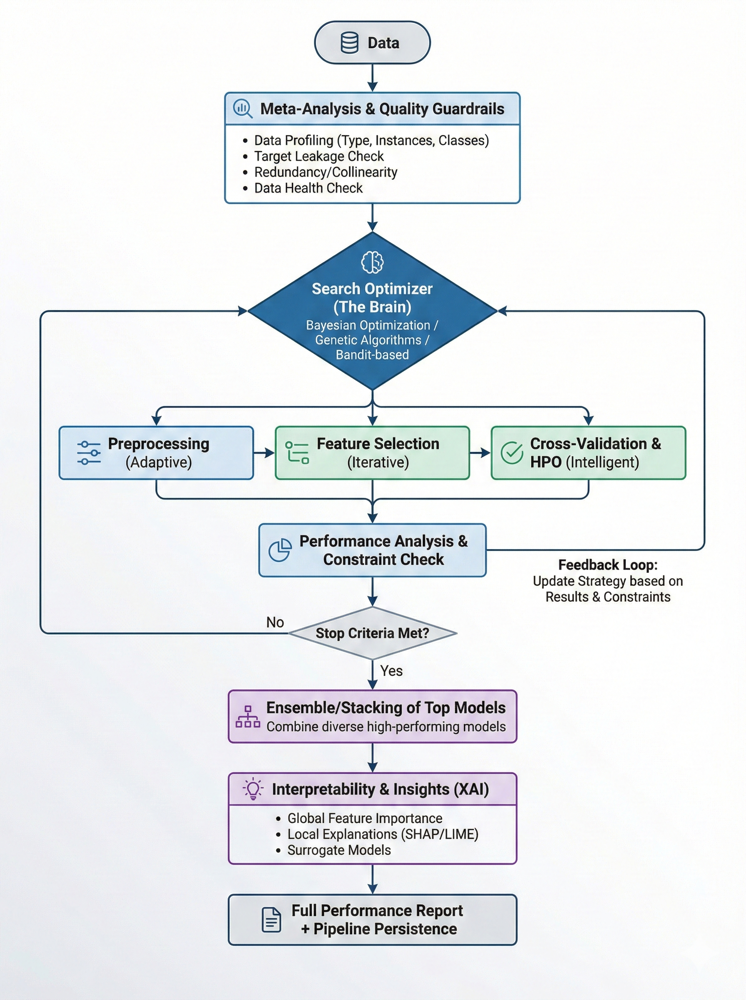

# AutoML Guide

Endgame provides a full AutoML system that automatically profiles data, checks
quality, selects and trains models, tunes hyperparameters, builds ensembles,
optimizes thresholds, generates explanations, and produces a structured
performance report — all behind a single `fit` / `predict` call.

**Import convention:** `import endgame as eg`

---

## Architecture



The AutoML pipeline executes 15 stages with intelligent time budget management.
Each stage receives a fraction of the total time budget and unused time is
automatically redistributed to later stages.

| # | Stage | Purpose |
|---|-------|---------|
| 1 | **Profiling** | Extract dataset meta-features (size, types, class balance, correlations) |
| 2 | **Quality Guardrails** | Detect target leakage, feature redundancy, data health issues |
| 3 | **Data Cleaning** | Handle missing values, remove constant columns |
| 4 | **Preprocessing** | Encoding, scaling, imputation |
| 5 | **Feature Engineering** | Aggregations, interactions, polynomial features |
| 6 | **Data Augmentation** | SMOTE, ADASYN for imbalanced datasets |
| 7 | **Model Selection** | Search strategy suggests model configurations |
| 8 | **Model Training** | Train models with cross-validation from 64+ registered models |
| 9 | **Constraint Check** | Validate models against deployment constraints (latency, size) |
| 10 | **Hyperparameter Tuning** | Optuna-based HPO for top-3 models |
| 11 | **Ensembling** | Hill climbing, stacking, or blending |
| 12 | **Threshold Optimization** | Optimize classification decision thresholds on OOF predictions |
| 13 | **Calibration** | Probability calibration (Platt, isotonic, temperature scaling) |
| 14 | **Post-Training** | Knowledge distillation, conformal prediction |
| 15 | **Explainability** | SHAP feature importances and feature interactions |

After the linear pipeline completes, a **feedback loop** can run up to 3
additional iterations if time permits — updating the search strategy with
results, suggesting new model configurations, and re-running ensembling with all
models.

A **performance report** is generated after the pipeline finishes, summarizing
the full run with leaderboard, stage timing, quality warnings, tuning results,
and top features.

---

## Quick Start

```python
from endgame.automl import TabularPredictor

predictor = TabularPredictor(label="target", presets="best_quality")
predictor.fit(train_df)

y_pred  = predictor.predict(test_df)
y_proba = predictor.predict_proba(test_df)

predictor.leaderboard()
```

`leaderboard()` returns a `pandas.DataFrame` ranked by validation score, one
row per trained model:

```
                 model  val_score  fit_time_s  pred_time_s
0        LGBMWrapper      0.9312       14.2         0.04
1         XGBWrapper      0.9287       18.6         0.06
2       FTTransformer      0.9241       92.0         0.31
3   HillClimbingEnsemble  0.9341        2.1         0.41
```

---

## Preset System

The `preset` argument controls the quality / speed trade-off. Six built-in
presets are available:

| Preset | Description | Default time | CV folds | Ensemble | HPO |
|---|---|---|---|---|---|
| `'best_quality'` | Maximum accuracy, all model families | No limit | 8 | Stacking | 100 trials |
| `'high_quality'` | High accuracy, most model families | 4 hours | 5 | Stacking | 50 trials |
| `'good_quality'` | Balanced speed and quality | 1 hour | 5 | Hill climbing | 25 trials |
| `'medium_quality'` | Fast with reasonable quality (default) | 15 min | 5 | Hill climbing | 10 trials |
| `'fast'` | GBDTs only, no HPO or ensembling | 5 min | 3 | None | None |
| `'interpretable'` | Glass-box models only (EBM, GAM, rules, trees) | 15 min | 5 | None | 25 trials |

```python
# Fast experiment — good for initial data exploration
predictor = TabularPredictor(label="target", presets="fast")
predictor.fit(train_df)

# Competition-grade — leave running overnight
predictor = TabularPredictor(label="target", presets="best_quality")
predictor.fit(train_df)

# Regulatory/compliance — interpretable models only
predictor = TabularPredictor(label="target", presets="interpretable")
predictor.fit(train_df)
```

Each preset defines time allocations for all 15 pipeline stages, curated model
pools, and search budgets. See `endgame/automl/presets.py` for full details.

---

## Quality Guardrails

The guardrails stage runs early in the pipeline and checks for:

- **Target leakage** — features with |correlation| > 0.95 with the target
- **Feature redundancy** — feature pairs with |correlation| > 0.98
- **Data health** — constant columns, all-missing columns, too few samples,
  extreme feature-to-sample ratio, minority class < 1%, ID-like columns

By default, issues are logged as warnings and the pipeline continues. To abort
on critical issues:

```python
predictor = TabularPredictor(
    label="target",
    presets="good_quality",
    guardrails_strict=True,  # Abort on critical issues
)
predictor.fit(train_df)
```

Quality warnings are included in the performance report:

```python
report = predictor.report()
for warning in report.quality_warnings:
    print(f"[{warning.severity}] {warning.message}")
```

---

## Deployment Constraints

Specify deployment constraints to automatically filter out non-compliant models:

```python
from endgame.automl import TabularPredictor, DeploymentConstraints

predictor = TabularPredictor(
    label="target",
    presets="good_quality",
    constraints=DeploymentConstraints(
        max_predict_latency_ms=10.0,   # Max 10ms per 100-sample batch
        max_model_size_mb=50.0,        # Max 50MB serialized
        require_interpretable=False,   # Allow black-box models
    ),
)
predictor.fit(train_df)
```

The constraint check stage runs after model training and before HPO, measuring
prediction latency and model size for each trained model. Non-compliant models
are flagged in the report but still available for inspection.

---

## Hyperparameter Tuning

When enabled in the preset (`hyperparameter_tune=True`), the HPO stage selects
the top-3 models by CV score and tunes them with Optuna. Tuning spaces are
defined per model in the model registry (e.g., `lgbm_standard`, `xgb_standard`,
`catboost_standard`).

The time budget for HPO is divided evenly across the top models. If tuning
improves a model's score, the tuned version replaces the original.

```python
# HPO is enabled by default for good_quality and above
predictor = TabularPredictor(label="target", presets="good_quality")
predictor.fit(train_df, time_limit=3600)

# Check tuning results
report = predictor.report()
for entry in report.tuning_summary:
    print(f"{entry['model']}: {entry['original_score']:.4f} → {entry['tuned_score']:.4f}")
```

---

## Threshold Optimization

For classification tasks, the threshold optimization stage finds optimal
decision thresholds using out-of-fold predictions. This is particularly
valuable for imbalanced datasets where the default 0.5 threshold is suboptimal.

The optimized thresholds are automatically applied in `predict()` when
available. This is transparent — no code changes needed.

---

## Explainability

The explainability stage computes SHAP-based feature importances for the best
model using a subsample of the training data. Results are stored in the
predictor and the performance report.

```python
predictor.fit(train_df)

# Access explanations
explanations = predictor.explain()
print("Top features:", explanations["top_features"])
print(explanations["feature_importance_df"])
```

---

## Performance Report

After fitting, a structured `AutoMLReport` is generated automatically. It
contains:

- **Summary** — preset, time limit, total time, best score, number of models
- **Stage summary** — per-stage timing and success status
- **Model leaderboard** — all trained models ranked by score
- **Quality warnings** — issues detected by the guardrails stage
- **Feature importances** — SHAP-based importances from the explainability stage
- **Tuning summary** — per-model HPO results (original vs tuned score)
- **Constraint violations** — deployment constraint failures

```python
predictor.fit(train_df)

# Get the report object
report = predictor.report()

# Print as markdown
print(report.to_markdown())

# Or convert to dict for programmatic access
data = report.to_dict()

# Display to stdout
report.display()
```

---

## Feedback Loop

When the preset enables HPO and time remains after the linear pipeline, a
feedback loop runs up to 3 additional iterations:

1. Update the search strategy with all results collected so far
2. Suggest 2 new model configurations not yet tried
3. Train them with 50% of remaining time
4. Merge results and re-run ensembling

This iterative refinement is automatic and requires no configuration. It
activates when at least 60 seconds remain in the time budget.

---

## Task Inference

`TabularPredictor` infers the task type from `y_train` automatically:

- Integer or string labels with fewer than 20 unique values → classification
- Float labels or integers with many unique values → regression

Override with the `problem_type` argument when automatic inference is wrong:

```python
predictor = TabularPredictor(label="target", problem_type="regression")
predictor.fit(train_df)
```

Supported values: `'binary'`, `'multiclass'`, `'regression'`, `'auto'`.

---

## Customising the Search

### Time limits

```python
predictor = TabularPredictor(
    label="target",
    presets="high_quality",
    time_limit=1800,    # seconds; stops search after 30 minutes
)
predictor.fit(train_df)
```

### Search strategies

Five search strategies are available:

| Strategy | Description |
|---|---|
| `'portfolio'` | Diverse model portfolio with heuristic ranking (default) |
| `'heuristic'` | Data-driven rules based on meta-features |
| `'genetic'` | Evolutionary optimization of full pipelines (model + preprocessing + hyperparameters) |
| `'random'` | Random valid pipeline sampling |
| `'bayesian'` | Optuna-based Bayesian optimization |

```python
predictor = TabularPredictor(
    label="target",
    presets="good_quality",
    search_strategy="bayesian",
)
predictor.fit(train_df)
```

#### Genetic / Evolutionary Search

The `'genetic'` strategy treats the entire pipeline as a genome and evolves it
using tournament selection, crossover, and mutation. Each individual encodes:

- **Model choice** and hyperparameters
- **Preprocessing steps** (imputation strategy, scaling, encoding)
- **Feature selection** method and top-k count
- **Dimensionality reduction** (PCA, none)

```python
predictor = TabularPredictor(
    label="target",
    presets="good_quality",
    search_strategy="genetic",
)
predictor.fit(train_df, time_limit=3600)
```

The genetic search is most effective with longer time budgets (30+ minutes) where
it has room for multiple generations. For quick experiments, `'portfolio'` or
`'heuristic'` converge faster.

### Custom evaluation metric

```python
from sklearn.metrics import f1_score

def macro_f1(y_true, y_pred):
    return f1_score(y_true, y_pred, average='macro')

predictor = TabularPredictor(
    label="target",
    presets="good_quality",
    eval_metric=macro_f1,
)
predictor.fit(train_df)
```

Built-in metric strings (`'roc_auc'`, `'accuracy'`, `'rmse'`, `'mae'`,
`'log_loss'`) are also accepted.

---

## Retrieving the Best Model

```python
best = predictor.get_model(predictor.fit_summary_.best_model)
y_pred = best.predict(X_test)

# Or use the predictor directly — delegates to the ensemble / best model
y_pred = predictor.predict(test_df)
```

---

## Ensembling

After individual models are trained, `TabularPredictor` runs the ensemble method
specified by the preset:

- `'hill_climbing'` — Forward model selection optimizing the evaluation metric
- `'stacking'` — Meta-learner trained on out-of-fold predictions
- `'none'` — No ensembling (fast and interpretable presets)

Ensembling runs after HPO and threshold optimization, so it operates on the best
available versions of each model.

---

## Domain-Specific Predictors

Specialised predictors extend `TabularPredictor` with domain defaults:

| Class | Domain | Notes |
|---|---|---|
| `TimeSeriesPredictor` | Forecasting | Wraps `eg.timeseries` models |
| `TextPredictor` | NLP / classification | Wraps `eg.nlp` transformers |
| `VisionPredictor` | Computer vision | Wraps `eg.vision` backbones |
| `MultiModalPredictor` | Multi-modal fusion | Combines tabular + text + image + audio |

```python
from endgame.automl import TimeSeriesPredictor

ts_pred = TimeSeriesPredictor(preset='high_quality', horizon=12)
ts_pred.fit(train_df, target_col='sales')
forecast = ts_pred.predict()
```

---

## Refit for Deployment

After `fit()` selects the best model via cross-validation, call `refit_full()`
to retrain on **all** available data (train + validation) for maximum
deployment performance:

```python
predictor = TabularPredictor(label="target", presets="best_quality")
predictor.fit(train_df)

# Retrain best model on all data before deploying
predictor.refit_full()

# Now predict with the full-data model
y_pred = predictor.predict(test_df)
```

Note: after `refit_full()`, the model can no longer be evaluated on a holdout
set. Use this only when you are ready to deploy.

---

## Experiment Tracking

Pass an experiment logger to automatically track parameters and metrics:

```python
from endgame.automl import TabularPredictor
from endgame.tracking import MLflowLogger

with MLflowLogger(experiment_name="my_project") as logger:
    predictor = TabularPredictor(label="target", logger=logger)
    predictor.fit(train_df)
```

See the [Tracking Guide](tracking.md) for full details on console logging,
MLflow integration, and custom backends.

---

## MultiModal Fusion Strategies

`MultiModalPredictor` supports five fusion strategies for combining predictions
across modalities (tabular, text, image, audio):

| Strategy | Description |
|---|---|
| `"late"` | Equal-weight averaging of predictions |
| `"weighted"` | Score-proportional or manual weights |
| `"stacking"` | Meta-learner (LogisticRegression/Ridge) on modality outputs |
| `"attention"` | Learned per-sample weights via MLP |
| `"embedding"` | Mid-level feature concatenation with GradientBoosting on top |

```python
from endgame.automl import MultiModalPredictor

predictor = MultiModalPredictor(
    label="sentiment",
    fusion_strategy="embedding",
    text_columns=["review"],
    tabular_columns=["price", "rating"],
)
predictor.fit(train_df)
```

---

## Saving and Loading

```python
from endgame.persistence import save, load

save(predictor, 'my_predictor.eg')

# Later, in a new session:
predictor = load('my_predictor.eg')
y_pred = predictor.predict(X_test)
```

---

## API Reference

Full parameter documentation is available in the auto-generated API reference
at `docs/api/automl.rst` or by calling `help(TabularPredictor)` at the Python
prompt.
