# Endgame Visualization Guide

A complete reference for the 42 interactive chart types in `endgame.visualization`. Every chart renders as a **self-contained HTML file** with no CDN dependencies — works offline, in Jupyter, or embedded in reports.

```python
import endgame as eg
from endgame.visualization import *  # all visualizers

# Common pattern: every chart supports
viz.save("chart.html")         # write HTML file
viz.save("chart.html", open_browser=True)  # open in browser
viz._repr_html_()              # Jupyter inline display
viz.to_json()                  # export data as JSON
```

All examples below use the best-fit sklearn dataset for each chart type: **breast cancer** (binary, 30 features), **iris** (3-class, 4 features), **wine** (3-class, 13 features), **digits** (10-class, 64 features), **california housing** (regression, 8 features), and **synthetic datasets** (hard/imbalanced classification via `make_classification`, 20newsgroups NLP text).

```python
# Setup used throughout this guide
import numpy as np
from sklearn.datasets import (
    load_breast_cancer, load_iris, load_wine, load_digits,
    fetch_california_housing, make_classification,
)
from sklearn.model_selection import cross_val_score, train_test_split, learning_curve
from sklearn.ensemble import (
    RandomForestClassifier, GradientBoostingClassifier,
    RandomForestRegressor, GradientBoostingRegressor,
)
from sklearn.linear_model import LogisticRegression
from sklearn.svm import SVC
from sklearn.tree import DecisionTreeClassifier
from sklearn.metrics import (
    accuracy_score, balanced_accuracy_score, f1_score, precision_score,
    recall_score, roc_auc_score, matthews_corrcoef, confusion_matrix,
)
from sklearn.preprocessing import StandardScaler
from sklearn.decomposition import PCA

# --- Breast cancer (binary, 30 features) ---
bc = load_breast_cancer()
X_bc, y_bc, fn_bc = bc.data, bc.target, list(bc.feature_names)
X_bc_tr, X_bc_te, y_bc_tr, y_bc_te = train_test_split(
    X_bc, y_bc, test_size=0.3, random_state=42, stratify=y_bc
)
rf_bc = RandomForestClassifier(n_estimators=200, max_depth=10, random_state=42).fit(X_bc_tr, y_bc_tr)
lr_bc = LogisticRegression(max_iter=5000, random_state=42).fit(X_bc_tr, y_bc_tr)
gb_bc = GradientBoostingClassifier(n_estimators=150, max_depth=5, random_state=42).fit(X_bc_tr, y_bc_tr)
svm_bc = SVC(probability=True, random_state=42).fit(X_bc_tr, y_bc_tr)

# --- Iris (3-class, 4 features) ---
iris = load_iris()
X_ir, y_ir, fn_ir, cn_ir = iris.data, iris.target, list(iris.feature_names), list(iris.target_names)
X_ir_tr, X_ir_te, y_ir_tr, y_ir_te = train_test_split(
    X_ir, y_ir, test_size=0.3, random_state=42, stratify=y_ir
)
rf_ir = RandomForestClassifier(n_estimators=100, max_depth=6, random_state=42).fit(X_ir_tr, y_ir_tr)
dt_ir = DecisionTreeClassifier(max_depth=4, random_state=42).fit(X_ir_tr, y_ir_tr)

# --- Wine (3-class, 13 features) ---
wine = load_wine()
X_wn, y_wn, fn_wn, cn_wn = wine.data, wine.target, list(wine.feature_names), list(wine.target_names)
X_wn_tr, X_wn_te, y_wn_tr, y_wn_te = train_test_split(
    X_wn, y_wn, test_size=0.3, random_state=42, stratify=y_wn
)
rf_wn = RandomForestClassifier(n_estimators=200, max_depth=8, random_state=42).fit(X_wn_tr, y_wn_tr)
gb_wn = GradientBoostingClassifier(n_estimators=100, max_depth=4, random_state=42).fit(X_wn_tr, y_wn_tr)

# --- Digits (10-class, 64 features) ---
digits = load_digits()
X_dg, y_dg = digits.data, digits.target
X_dg_tr, X_dg_te, y_dg_tr, y_dg_te = train_test_split(
    X_dg, y_dg, test_size=0.3, random_state=42, stratify=y_dg
)
rf_dg = RandomForestClassifier(n_estimators=200, max_depth=15, random_state=42).fit(X_dg_tr, y_dg_tr)

# --- California housing (regression, 8 features) ---
cal = fetch_california_housing()
X_cal, y_cal, fn_cal = cal.data[:2000], cal.target[:2000], list(cal.feature_names)
X_cal_tr, X_cal_te, y_cal_tr, y_cal_te = train_test_split(
    X_cal, y_cal, test_size=0.3, random_state=42
)
rf_cal = RandomForestRegressor(n_estimators=100, max_depth=10, random_state=42).fit(X_cal_tr, y_cal_tr)

# --- Hard synthetic classification (noisy, for ROC/radar/gauge) ---
X_hard, y_hard = make_classification(
    n_samples=2000, n_features=20, n_informative=8, n_redundant=4,
    flip_y=0.15, class_sep=0.6, random_state=42,
)
X_hard_tr, X_hard_te, y_hard_tr, y_hard_te = train_test_split(
    X_hard, y_hard, test_size=0.3, random_state=42, stratify=y_hard,
)
rf_hard = RandomForestClassifier(n_estimators=200, max_depth=10, random_state=42).fit(X_hard_tr, y_hard_tr)
lr_hard = LogisticRegression(max_iter=5000, random_state=42).fit(X_hard_tr, y_hard_tr)
gb_hard = GradientBoostingClassifier(n_estimators=150, max_depth=5, random_state=42).fit(X_hard_tr, y_hard_tr)
dt_hard = DecisionTreeClassifier(max_depth=5, random_state=42).fit(X_hard_tr, y_hard_tr)

# --- Imbalanced classification (92/8 split, for PR/nightingale) ---
X_imb, y_imb = make_classification(
    n_samples=3000, n_features=20, n_informative=8, n_redundant=4,
    flip_y=0.05, class_sep=0.5, weights=[0.92, 0.08], random_state=42,
)
X_imb_tr, X_imb_te, y_imb_tr, y_imb_te = train_test_split(
    X_imb, y_imb, test_size=0.3, random_state=42, stratify=y_imb,
)
rf_imb = RandomForestClassifier(n_estimators=200, max_depth=10, random_state=42).fit(X_imb_tr, y_imb_tr)
gb_imb = GradientBoostingClassifier(n_estimators=150, max_depth=5, random_state=42).fit(X_imb_tr, y_imb_tr)
lr_imb = LogisticRegression(max_iter=5000, random_state=42).fit(X_imb_tr, y_imb_tr)
```

---

## Table of Contents

- [ML Evaluation Charts](#ml-evaluation-charts-tier-a) — ROC, PR, Calibration, Lift, PDP, Waterfall
- [Core Charts](#core-charts-tier-1) — Bar, Heatmap, Confusion Matrix, Histogram, Line, Scatter
- [Statistical Charts](#statistical-charts-tier-2) — Box, Violin, Error Bars, Parallel Coordinates, Radar, Treemap, Sunburst
- [Flow & Composition](#flow--composition-tier-3) — Sankey, Dot Matrix, Venn, Word Cloud
- [Extended Charts](#extended-charts-tier-4) — Arc, Chord, Donut, Flow, Network, Nightingale Rose, Radial Bar, Spiral, Stream
- [General-Purpose Charts](#general-purpose-charts-tier-b) — Ridgeline, Bump, Lollipop, Dumbbell, Funnel, Gauge
- [Decision Tree](#decision-tree) — TreeVisualizer

---

## ML Evaluation Charts (Tier A)

### ROC Curve

**What:** Plots True Positive Rate vs False Positive Rate at all classification thresholds. Annotates AUC and marks the optimal operating point (Youden's J statistic).

**When to use:** Evaluating binary or multiclass classifiers. Comparing discriminative ability of multiple models. Choosing a threshold for deployment.

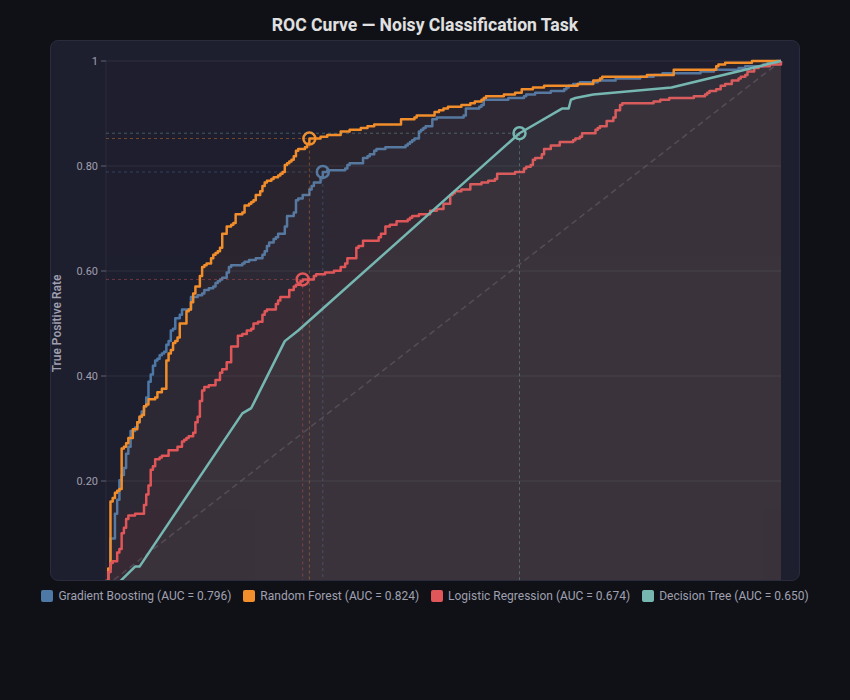

```python
from endgame.visualization import ROCCurveVisualizer

# Hard synthetic dataset — 4 models with spread AUCs (0.65–0.82)
from sklearn.metrics import roc_curve, auc
y_scores = {
    "Gradient Boosting": gb_hard.predict_proba(X_hard_te)[:, 1],
    "Random Forest": rf_hard.predict_proba(X_hard_te)[:, 1],
    "Logistic Regression": lr_hard.predict_proba(X_hard_te)[:, 1],
    "Decision Tree": dt_hard.predict_proba(X_hard_te)[:, 1],
}
curves = []
for label, scores in y_scores.items():
    fpr, tpr, thresholds = roc_curve(y_hard_te, scores)
    roc_auc = auc(fpr, tpr)
    best_idx = int(np.argmax(tpr - fpr))
    curves.append({
        "fpr": fpr.tolist(), "tpr": tpr.tolist(),
        "auc": round(float(roc_auc), 4),
        "label": f"{label} (AUC = {roc_auc:.3f})",
        "optimalPoint": {"fpr": float(fpr[best_idx]), "tpr": float(tpr[best_idx]),
                         "threshold": float(thresholds[best_idx])},
    })
viz = ROCCurveVisualizer(curves, title="ROC Curve — Noisy Classification Task")
viz.save("roc_comparison.html")
```

---

### Precision-Recall Curve

**What:** Plots Precision vs Recall, annotates Average Precision (AP), marks the F1-optimal threshold, and shows the no-skill baseline (prevalence).

**When to use:** Imbalanced classification — when positive class is rare (fraud, disease, defects). PR curves are more informative than ROC when class imbalance is severe.

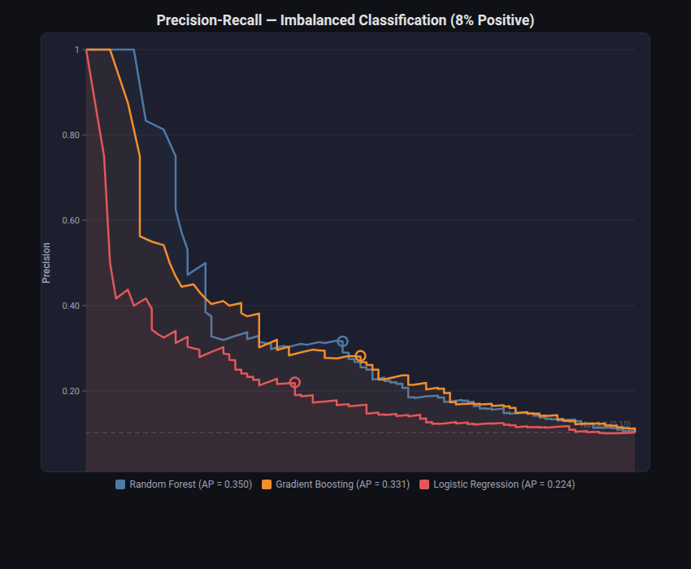

```python
from endgame.visualization import PRCurveVisualizer

# Imbalanced dataset (92/8 split) — 3 models, shows classic PR shape
from sklearn.metrics import precision_recall_curve, average_precision_score
y_imb_scores = {
    "Random Forest": rf_imb.predict_proba(X_imb_te)[:, 1],
    "Gradient Boosting": gb_imb.predict_proba(X_imb_te)[:, 1],
    "Logistic Regression": lr_imb.predict_proba(X_imb_te)[:, 1],
}
pr_curves = []
for label, scores in y_imb_scores.items():
    prec, rec, thresholds = precision_recall_curve(y_imb_te, scores)
    ap = average_precision_score(y_imb_te, scores)
    f1_arr = 2 * prec[:-1] * rec[:-1] / np.maximum(prec[:-1] + rec[:-1], 1e-8)
    best_idx = int(np.argmax(f1_arr))
    pr_curves.append({
        "precision": prec.tolist(), "recall": rec.tolist(),
        "ap": round(float(ap), 4),
        "label": f"{label} (AP = {ap:.3f})",
        "optimalPoint": {"precision": float(prec[best_idx]), "recall": float(rec[best_idx]),
                         "threshold": float(thresholds[best_idx]),
                         "f1": float(f1_arr[best_idx])},
    })
viz = PRCurveVisualizer(
    pr_curves, prevalence=float(y_imb_te.mean()),
    title="Precision-Recall — Imbalanced Classification (8% Positive)",
)
viz.save("pr_curve.html")
```

---

### Calibration Plot

**What:** Reliability diagram comparing predicted probabilities against observed frequencies, plus a histogram of prediction distribution. Reports Expected Calibration Error (ECE) and Maximum Calibration Error (MCE).

**When to use:** After probability calibration (`eg.calibration`), before deploying models that output probabilities for decision-making. Comparing calibration quality of multiple models.

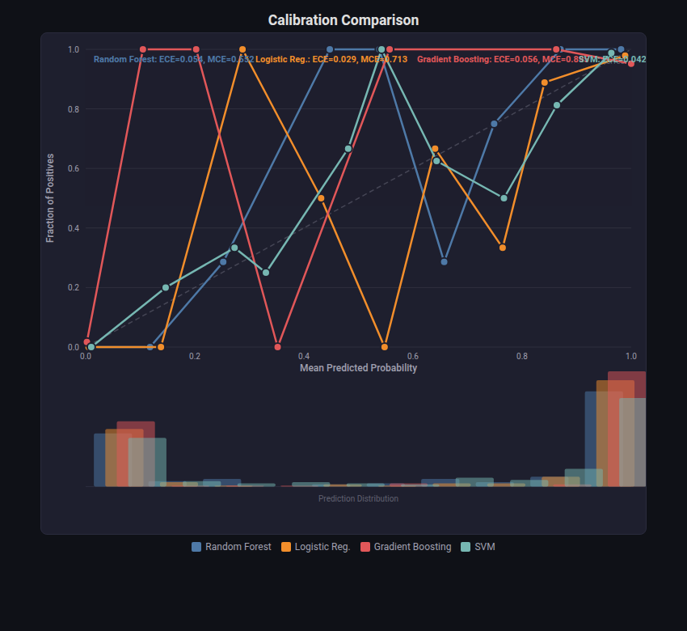

```python
from endgame.visualization import CalibrationPlotVisualizer

# Compare 4 models on breast cancer
viz = CalibrationPlotVisualizer.from_multiple(
    y_bc_te,
    {"Random Forest": rf_bc.predict_proba(X_bc_te)[:, 1],
     "Logistic Reg.": lr_bc.predict_proba(X_bc_te)[:, 1],
     "Gradient Boosting": gb_bc.predict_proba(X_bc_te)[:, 1],
     "SVM": svm_bc.predict_proba(X_bc_te)[:, 1]},
    n_bins=10,
)
viz.save("calibration_comparison.html")
```

---

### Lift / Cumulative Gains Chart

**What:** Dual-panel chart showing (1) cumulative gains — fraction of positives captured by top-k% of predictions, and (2) lift — how many times better the model is than random at each percentile.

**When to use:** Marketing/business ML — targeting top customers, prioritizing leads, fraud triage. Answers "if I can only act on 20% of cases, how many positives will I catch?"

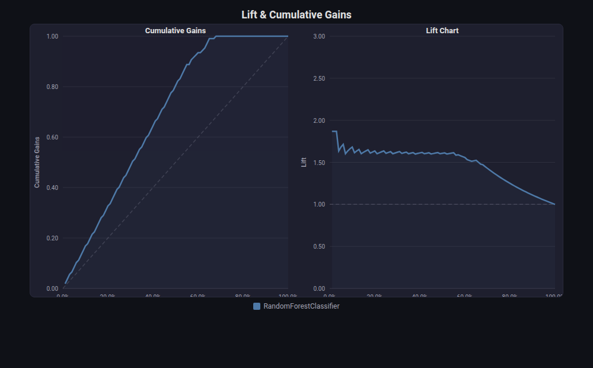

```python
from endgame.visualization import LiftChartVisualizer

# Breast cancer — binary classification
viz = LiftChartVisualizer.from_estimator(rf_bc, X_bc_te, y_bc_te)
viz.save("lift_chart.html")

# Gains only (without lift panel)
viz = LiftChartVisualizer.from_estimator(rf_bc, X_bc_te, y_bc_te, mode="gains")
viz.save("gains_only.html")
```

---

### Partial Dependence Plot (PDP / ICE)

**What:** Shows the marginal effect of a single feature on the model's prediction. PDP shows the average effect; ICE (Individual Conditional Expectation) shows per-sample curves revealing heterogeneity.

**When to use:** Model interpretability — understanding how a feature influences predictions. Detecting non-linear relationships. Sanity-checking that the model learned reasonable patterns.

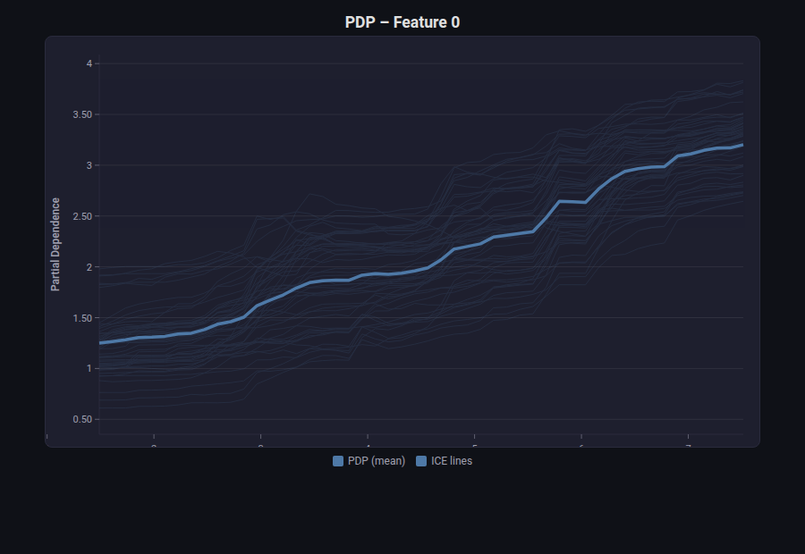

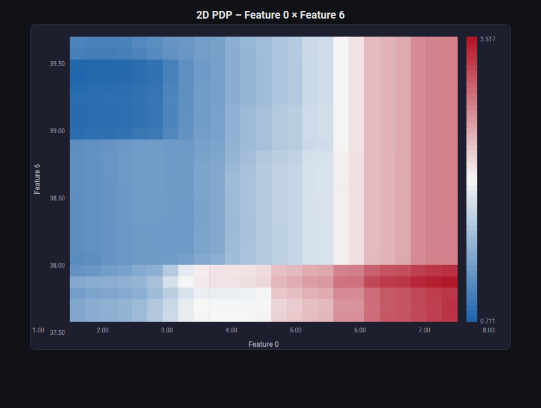

```python
from endgame.visualization import PDPVisualizer, PDP2DVisualizer

# California housing (regression) — continuous features show smooth PDP curves
viz = PDPVisualizer.from_estimator(rf_cal, X_cal_tr, feature=0, n_ice_lines=50)
viz.save("pdp_medinc.html")

# 2D interaction — MedInc x AveOccup
viz = PDP2DVisualizer.from_estimator(rf_cal, X_cal_tr, features=(0, 6), grid_resolution=25)
viz.save("pdp_2d.html")
```

---

### Waterfall Chart

**What:** Shows how each feature's contribution pushes a prediction up or down from a baseline, one step at a time. Positive contributions go right (green), negative go left (red).

**When to use:** Explaining individual predictions (SHAP explanations). Showing sequential decomposition of any quantity (revenue breakdown, error attribution). Model debugging.

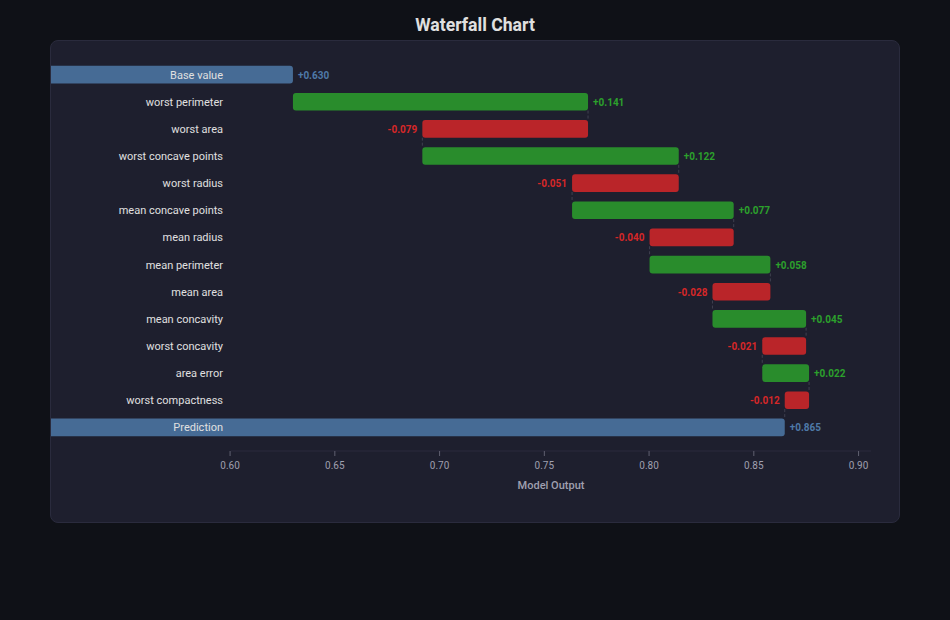

```python
from endgame.visualization import WaterfallVisualizer

# Breast cancer feature contributions
top_idx = np.argsort(rf_bc.feature_importances_)[::-1][:12]
top_names = [fn_bc[i] for i in top_idx]
top_vals = [float(rf_bc.feature_importances_[i]) for i in top_idx]
# Alternate signs for demonstration (use SHAP values for real explanations)
signed_vals = [v * (1 if i % 2 == 0 else -0.6) for i, v in enumerate(top_vals)]
viz = WaterfallVisualizer.from_contributions(
    top_names, signed_vals, base_value=0.63,
)
viz.save("waterfall.html")
```

---

## Core Charts (Tier 1)

### Bar Chart

**What:** Vertical or horizontal bars. Supports stacking, sorting, and grouped bars.

**When to use:** Feature importances, metric comparisons, category counts. The workhorse of ML reporting.

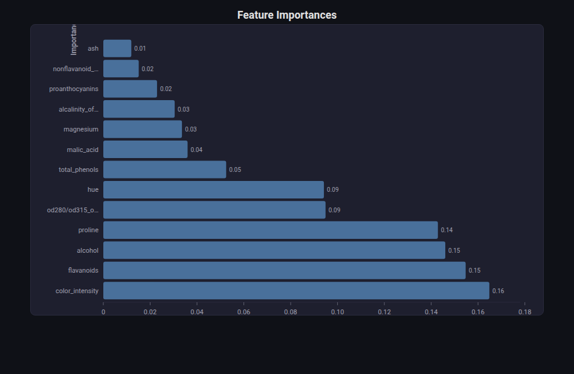

```python
from endgame.visualization import BarChartVisualizer

# Wine feature importances — 13 well-named features
viz = BarChartVisualizer.from_importances(rf_wn, feature_names=fn_wn, top_n=13)
viz.save("feature_importances.html")

# From a dictionary
scores = {"RF": 0.91, "LR": 0.85, "GB": 0.93}
viz = BarChartVisualizer.from_dict(scores, title="Model Comparison")
viz.save("model_scores.html")
```

---

### Heatmap

**What:** Color-coded matrix with optional cell annotations.

**When to use:** Correlation matrices, feature-feature relationships, hyperparameter grids. Any 2D numeric matrix.

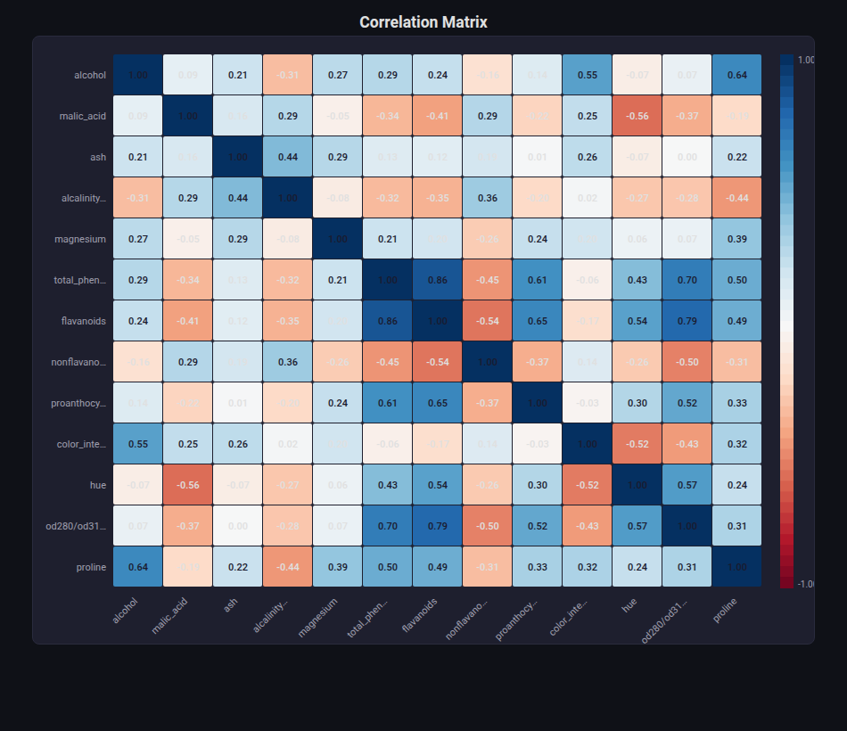

```python
from endgame.visualization import HeatmapVisualizer

# Wine correlation matrix — 13 features with interesting correlations
viz = HeatmapVisualizer.from_correlation(X_wn, feature_names=fn_wn)
viz.save("correlation_heatmap.html")
```

---

### Confusion Matrix

**What:** Annotated heatmap of predicted vs actual classes, with per-class precision, recall, F1, and overall accuracy.

**When to use:** Classification evaluation. Understanding which classes are confused with each other. Essential for multiclass problems.

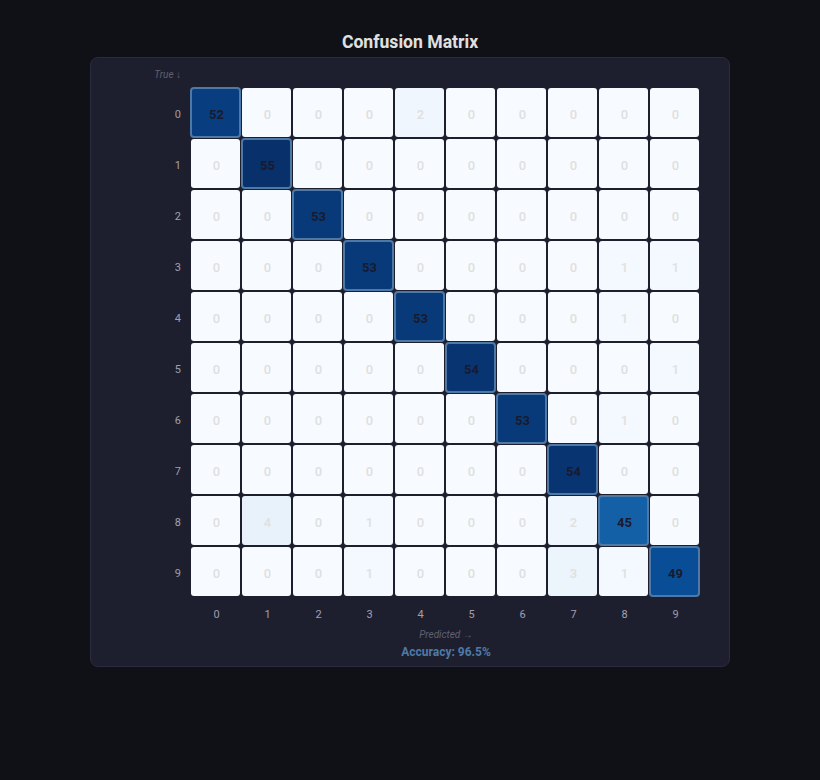

```python
from endgame.visualization import ConfusionMatrixVisualizer

# Digits — 10×10 confusion matrix (rich misclassification patterns)
viz = ConfusionMatrixVisualizer.from_estimator(
    rf_dg, X_dg_te, y_dg_te, class_names=[str(i) for i in range(10)],
)
viz.save("confusion_matrix.html")

# Normalized version
viz = ConfusionMatrixVisualizer.from_estimator(
    rf_dg, X_dg_te, y_dg_te, class_names=[str(i) for i in range(10)], normalize=True,
)
viz.save("confusion_matrix_normalized.html")
```

---

### Histogram

**What:** Frequency distribution with optional KDE overlay, density mode, and cumulative mode. Supports multiple overlaid series.

**When to use:** Exploring feature distributions, inspecting residuals, checking prediction score distributions, comparing train/test distributions.

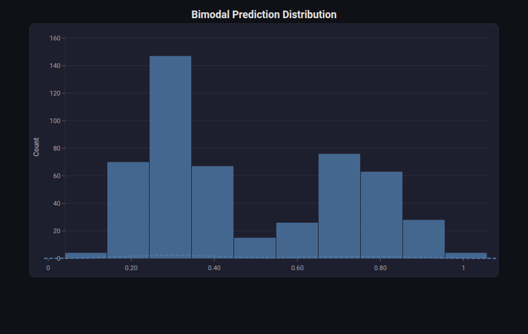

```python
from endgame.visualization import HistogramVisualizer

# Synthetic bimodal prediction distribution
np.random.seed(42)
bimodal = np.concatenate([
    np.random.normal(0.3, 0.08, 300),
    np.random.normal(0.75, 0.1, 200),
])
viz = HistogramVisualizer(
    [bimodal.tolist()],
    series_names=["Prediction Scores"],
    kde=True,
    title="Bimodal Prediction Distribution",
)
viz.save("prediction_distribution.html")
```

---

### Line Chart

**What:** Multi-series line chart with optional error bands, area fill, and markers.

**When to use:** Learning curves, training loss over epochs, CV scores across folds, metric trends over time.

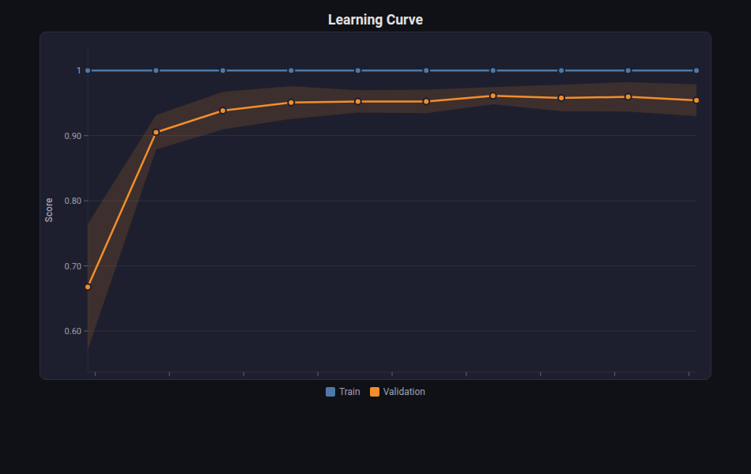

```python
from endgame.visualization import LineChartVisualizer

# Breast cancer learning curve — shows overfitting gap
sizes, train_scores, test_scores = learning_curve(
    RandomForestClassifier(n_estimators=50, max_depth=15, random_state=42),
    X_bc, y_bc, cv=5, n_jobs=-1,
    train_sizes=np.linspace(0.1, 1.0, 10), scoring="accuracy",
)
viz = LineChartVisualizer.from_learning_curve(
    sizes.tolist(), train_scores.tolist(), test_scores.tolist(),
)
viz.save("learning_curve.html")
```

---

### Scatterplot

**What:** 2D scatter with optional color-coding, bubble sizes, regression lines, and diagonal reference.

**When to use:** Predicted vs actual (regression), 2D embeddings (t-SNE/UMAP), feature relationships, residual plots.

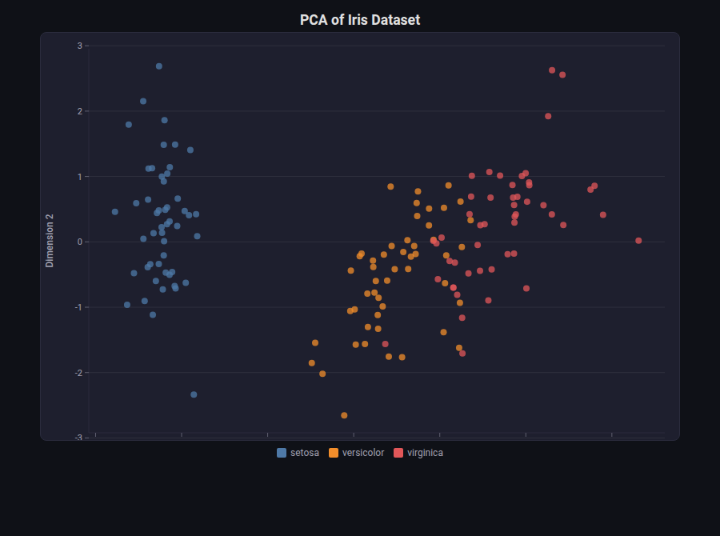

```python
from endgame.visualization import ScatterplotVisualizer

# Iris PCA embedding — 3 well-separated clusters
emb = PCA(n_components=2).fit_transform(StandardScaler().fit_transform(X_ir))
label_names = [cn_ir[yi] for yi in y_ir]
viz = ScatterplotVisualizer.from_embedding(
    emb, labels=label_names, title="PCA of Iris Dataset",
)
viz.save("pca_embedding.html")
```

---

## Statistical Charts (Tier 2)

### Box Plot

**What:** Box-and-whisker plots showing median, quartiles, and outliers for grouped data.

**When to use:** Comparing CV score distributions across models, examining feature distributions by class, detecting outliers.

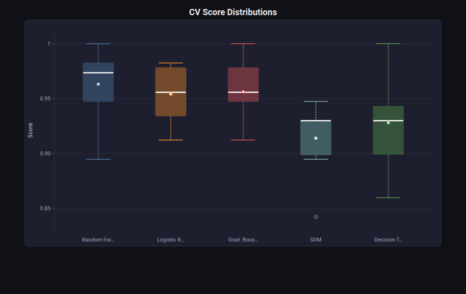

```python
from endgame.visualization import BoxPlotVisualizer

# 5-model CV comparison on breast cancer (10-fold)
cv_scores = {
    "Random Forest": cross_val_score(rf_bc, X_bc, y_bc, cv=10, scoring="accuracy").tolist(),
    "Logistic Reg.": cross_val_score(lr_bc, X_bc, y_bc, cv=10, scoring="accuracy").tolist(),
    "Grad. Boosting": cross_val_score(gb_bc, X_bc, y_bc, cv=10, scoring="accuracy").tolist(),
    "SVM": cross_val_score(svm_bc, X_bc, y_bc, cv=10, scoring="accuracy").tolist(),
    "Decision Tree": cross_val_score(
        DecisionTreeClassifier(max_depth=5, random_state=42),
        X_bc, y_bc, cv=10, scoring="accuracy",
    ).tolist(),
}
viz = BoxPlotVisualizer.from_cv_results(cv_scores)
viz.save("cv_boxplot.html")
```

---

### Violin Plot

**What:** Like box plots but shows the full KDE density shape, revealing multi-modality and distribution shape.

**When to use:** When box plots hide important distributional details — bimodal scores, skewed feature values, comparing dense distributions.

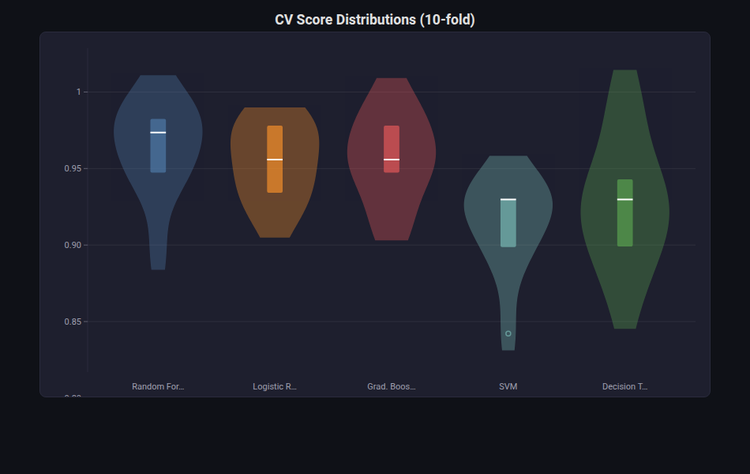

```python
from endgame.visualization import ViolinPlotVisualizer

# Same 5-model comparison as box plot
viz = ViolinPlotVisualizer(cv_scores, title="CV Score Distributions (10-fold)")
viz.save("cv_violin.html")
```

---

### Error Bars

**What:** Mean values with symmetric or asymmetric confidence intervals.

**When to use:** Reporting model metrics with uncertainty bounds. Comparing models when you need to see if confidence intervals overlap.

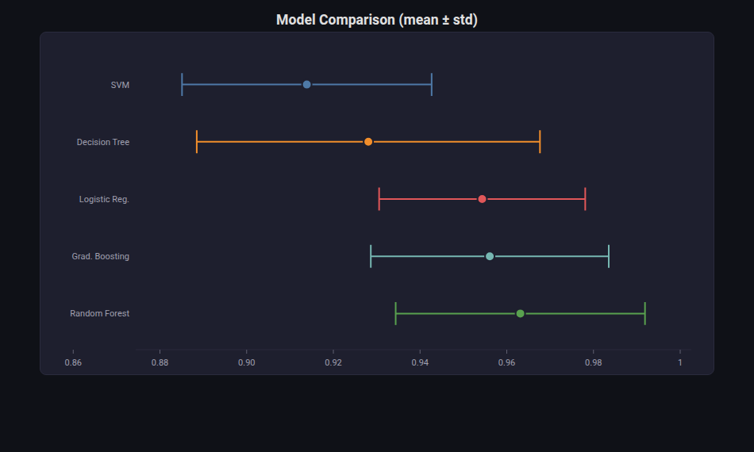

```python
from endgame.visualization import ErrorBarsVisualizer

viz = ErrorBarsVisualizer.from_cv_results(cv_scores)
viz.save("cv_error_bars.html")
```

---

### Parallel Coordinates

**What:** Multi-dimensional data where each variable is a vertical axis and each observation is a polyline connecting its values.

**When to use:** Hyperparameter search visualization — see which combinations of parameters lead to high scores. Optuna study exploration.

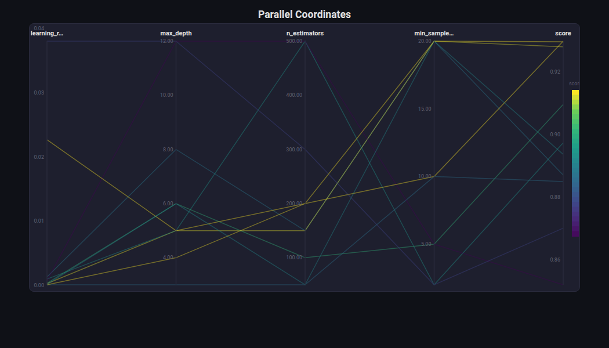

```python
from endgame.visualization import ParallelCoordinatesVisualizer

# Synthetic hyperparameter search — 10 trials
np.random.seed(42)
trials = []
for _ in range(10):
    lr_val = 10 ** np.random.uniform(-4, -1)
    depth = int(np.random.choice([3, 4, 5, 6, 8, 10, 12]))
    n_est = int(np.random.choice([50, 100, 150, 200, 300, 500]))
    min_split = int(np.random.choice([2, 5, 10, 20]))
    score = 0.85 + 0.05 * np.exp(-((depth - 5)**2) / 8) + np.random.normal(0, 0.005)
    trials.append({
        "learning_rate": round(lr_val, 5), "max_depth": depth,
        "n_estimators": n_est, "min_samples_split": min_split,
        "score": round(float(score), 4),
    })
viz = ParallelCoordinatesVisualizer(trials, color_by="score")
viz.save("hyperparameter_search.html")
```

---

### Radar Chart

**What:** Multi-axis radial chart comparing several series across shared dimensions.

**When to use:** Comparing models across multiple metrics simultaneously (accuracy, precision, recall, F1, AUC). Quick "profile" view of model strengths/weaknesses.

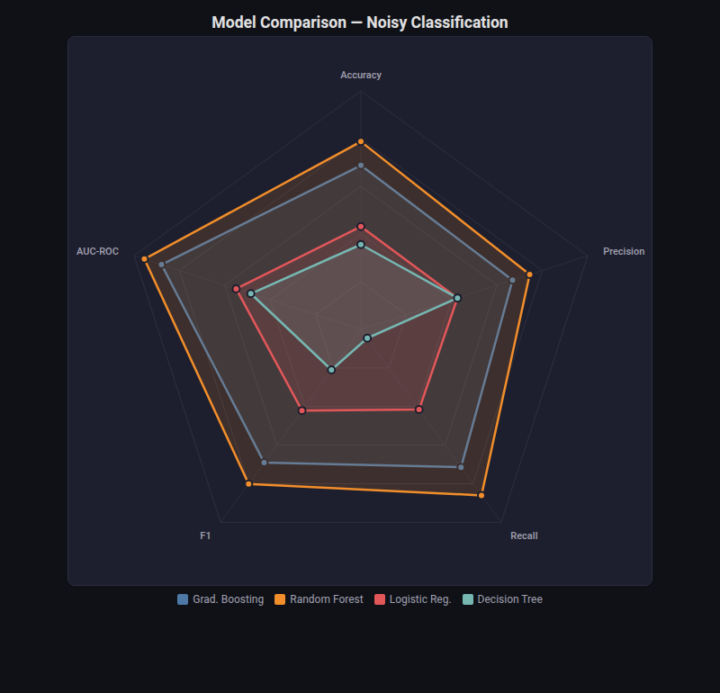

```python
from endgame.visualization import RadarChartVisualizer

# Hard synthetic — 4 models with distinct strength profiles
radar_models = {
    "Grad. Boosting": gb_hard, "Random Forest": rf_hard,
    "Logistic Reg.": lr_hard, "Decision Tree": dt_hard,
}
radar_series = {}
for name, mdl in radar_models.items():
    yp = mdl.predict(X_hard_te)
    yproba = mdl.predict_proba(X_hard_te)[:, 1]
    radar_series[name] = [
        round(accuracy_score(y_hard_te, yp), 3),
        round(precision_score(y_hard_te, yp), 3),
        round(recall_score(y_hard_te, yp), 3),
        round(f1_score(y_hard_te, yp), 3),
        round(roc_auc_score(y_hard_te, yproba), 3),
    ]
viz = RadarChartVisualizer(
    dimensions=["Accuracy", "Precision", "Recall", "F1", "AUC-ROC"],
    series=radar_series,
    title="Model Comparison — Noisy Classification",
)
viz.save("model_comparison_radar.html")
```

---

### Treemap

**What:** Nested rectangles where area encodes magnitude. Uses a squarified layout.

**When to use:** Feature importance as proportional area. Hierarchical breakdowns (e.g., model ensemble weights by model type).

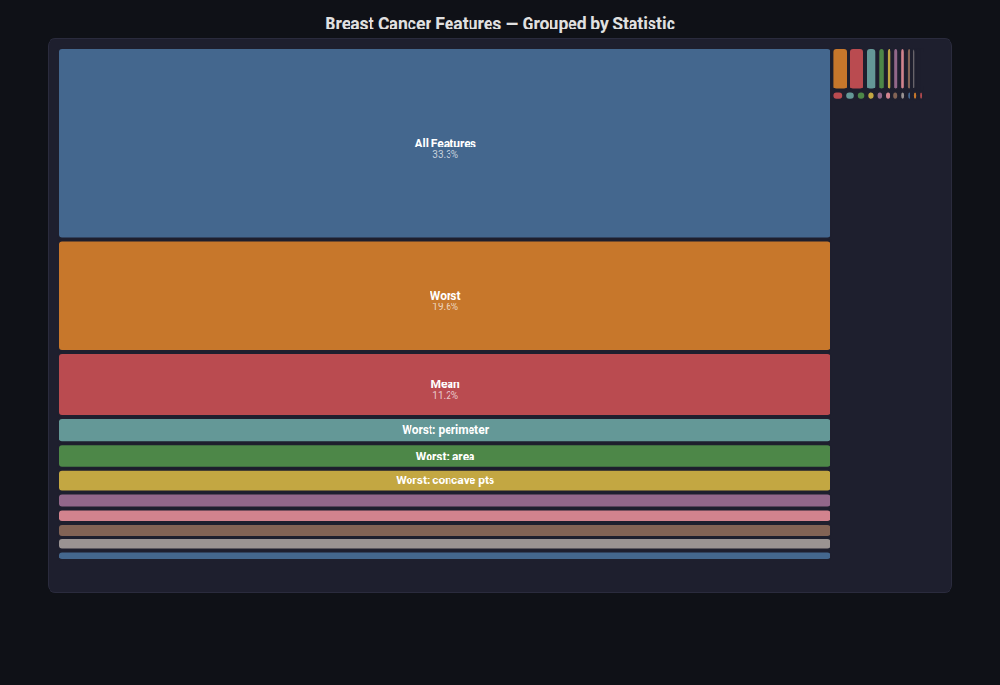

```python
from endgame.visualization import TreemapVisualizer

# Hierarchical treemap — breast cancer features grouped by Mean/SE/Worst
measurements = ["radius", "texture", "perimeter", "area", "smoothness",
                "compactness", "concavity", "concave pts", "symmetry", "fractal dim"]
groups = ["Mean", "Std Error", "Worst"]
importances = rf_bc.feature_importances_

tm_labels, tm_parents, tm_values = ["All Features"], [""], [float(importances.sum())]
for gi, group in enumerate(groups):
    tm_labels.append(group)
    tm_parents.append("All Features")
    tm_values.append(float(importances[gi * 10:(gi + 1) * 10].sum()))
    for mi, meas in enumerate(measurements):
        tm_labels.append(f"{group}: {meas}")
        tm_parents.append(group)
        tm_values.append(float(importances[gi * 10 + mi]))

viz = TreemapVisualizer(
    labels=tm_labels, values=tm_values, parents=tm_parents,
    title="Breast Cancer Features — Grouped by Statistic",
)
viz.save("importance_treemap.html")
```

---

### Sunburst

**What:** Concentric rings showing hierarchical data — inner ring is parent, outer rings are children.

**When to use:** Hierarchical feature groups, nested category breakdowns, ensemble composition.

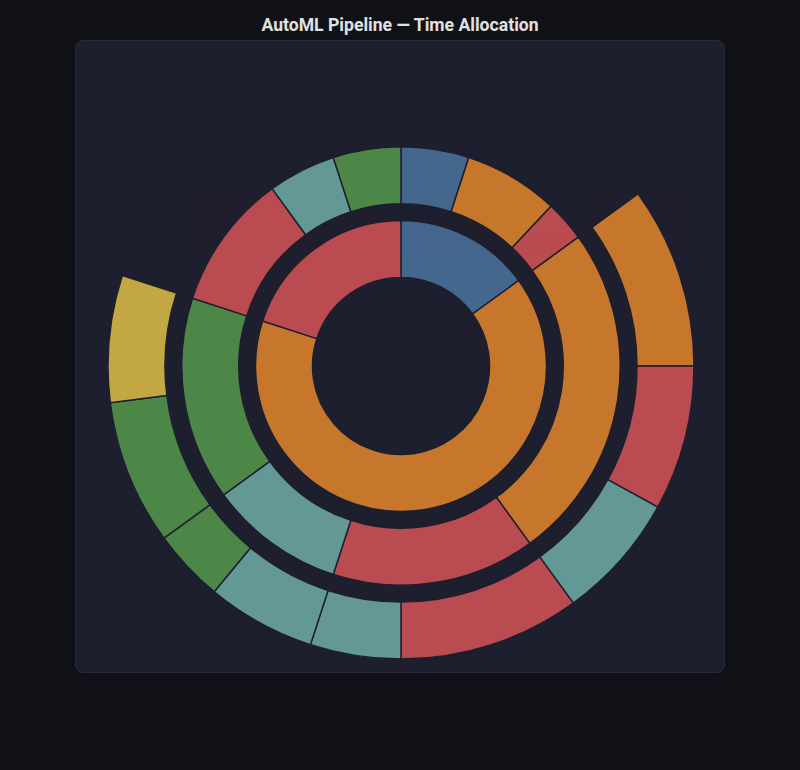

```python
from endgame.visualization import SunburstVisualizer

# AutoML pipeline time allocation — 3-level hierarchy
viz = SunburstVisualizer(
    labels=[
        "AutoML Pipeline",
        "Data Preparation", "Model Training", "Post-Processing",
        "Cleaning", "Feature Eng.", "Augmentation",
        "GBDTs", "Trees", "Linear", "Neural Nets",
        "Ensembling", "Calibration", "Threshold Opt.",
        "XGBoost", "LightGBM", "CatBoost",
        "Random Forest", "Extra Trees",
        "Logistic Reg.", "Ridge",
        "MLP", "TabNet",
    ],
    parents=[
        "",
        "AutoML Pipeline", "AutoML Pipeline", "AutoML Pipeline",
        "Data Preparation", "Data Preparation", "Data Preparation",
        "Model Training", "Model Training", "Model Training", "Model Training",
        "Post-Processing", "Post-Processing", "Post-Processing",
        "GBDTs", "GBDTs", "GBDTs",
        "Trees", "Trees",
        "Linear", "Linear",
        "Neural Nets", "Neural Nets",
    ],
    values=[
        1.0,
        0.15, 0.65, 0.20,
        0.05, 0.07, 0.03,
        0.25, 0.15, 0.10, 0.15,
        0.10, 0.05, 0.05,
        0.10, 0.08, 0.07,
        0.10, 0.05,
        0.06, 0.04,
        0.08, 0.07,
    ],
    title="AutoML Pipeline — Time Allocation",
)
viz.save("pipeline_sunburst.html")
```

---

## Flow & Composition (Tier 3)

### Sankey Diagram

**What:** Flow diagram where link width encodes magnitude between nodes.

**When to use:** Visualizing prediction flow (e.g., true class -> predicted class), data pipeline transformations, feature selection cascades.

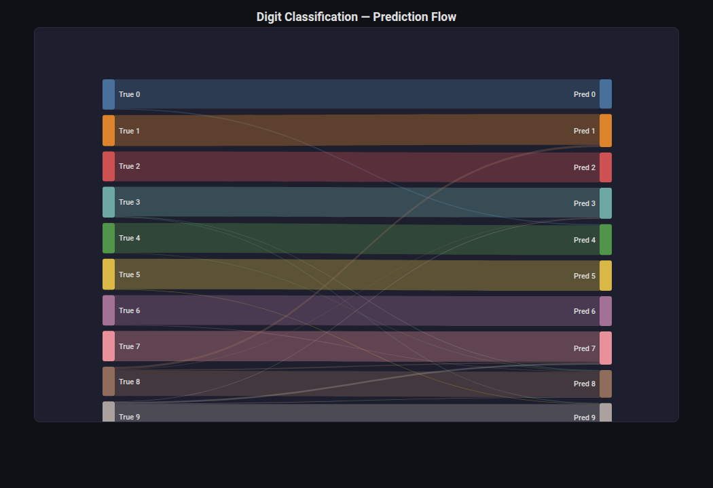

```python
from endgame.visualization import SankeyVisualizer

# Digits — 10-class prediction flow (much richer than binary)
cm = confusion_matrix(y_dg_te, rf_dg.predict(X_dg_te))
classes = [str(i) for i in range(10)]
nodes = [f"True {c}" for c in classes] + [f"Pred {c}" for c in classes]
links = []
for i in range(10):
    for j in range(10):
        if cm[i][j] > 0:
            links.append((f"True {i}", f"Pred {j}", int(cm[i][j])))

viz = SankeyVisualizer(nodes=nodes, links=links, title="Digit Classification — Prediction Flow")
viz.save("prediction_sankey.html")
```

---

### Dot Matrix

**What:** Grid of colored dots representing proportions (e.g., 85 green, 15 red out of 100).

**When to use:** Intuitive "icon array" showing accuracy/error rates, class balance, or any proportional breakdown to non-technical audiences.

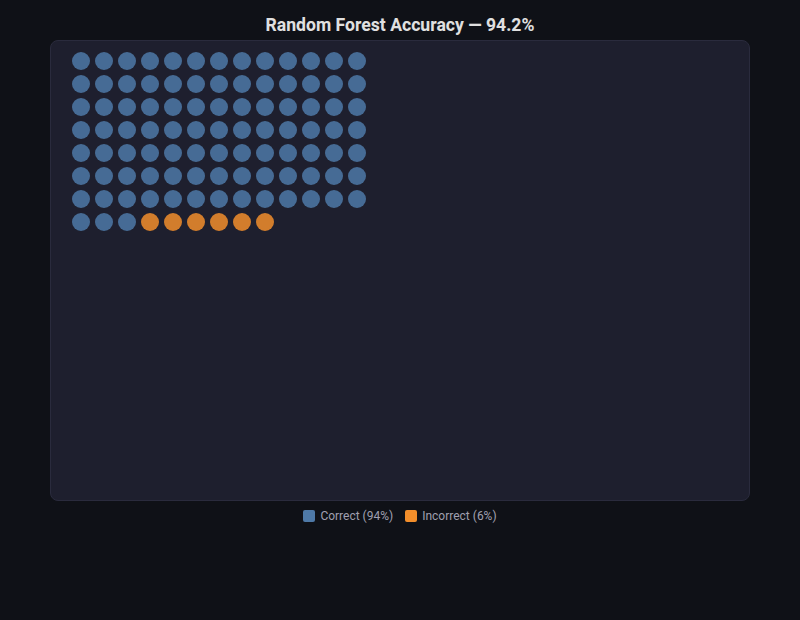

```python
from endgame.visualization import DotMatrixVisualizer

# Breast cancer accuracy breakdown
acc = accuracy_score(y_bc_te, rf_bc.predict(X_bc_te))
viz = DotMatrixVisualizer(
    labels=["Correct", "Incorrect"],
    values=[int(acc * 100), 100 - int(acc * 100)],
    n_dots=100,
    title=f"Random Forest Accuracy — {acc:.1%}",
)
viz.save("accuracy_dots.html")
```

---

### Venn Diagram

**What:** Overlapping circles for 2 or 3 sets, showing set sizes and intersections.

**When to use:** Comparing which samples are correctly predicted by different models. Feature overlap between selection methods.

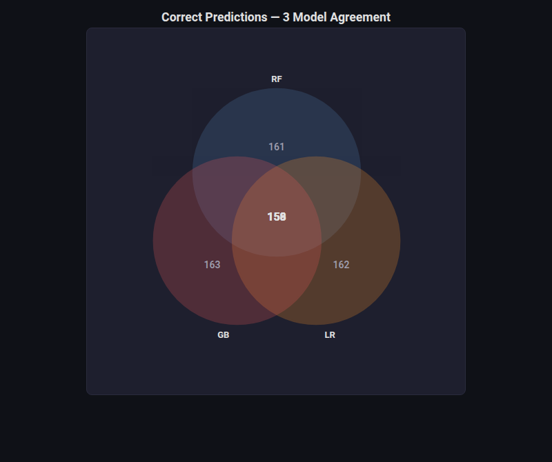

```python
from endgame.visualization import VennDiagramVisualizer

# 3-model agreement on breast cancer
rf_correct = set(np.where(rf_bc.predict(X_bc_te) == y_bc_te)[0])
lr_correct = set(np.where(lr_bc.predict(X_bc_te) == y_bc_te)[0])
gb_correct = set(np.where(gb_bc.predict(X_bc_te) == y_bc_te)[0])

viz = VennDiagramVisualizer(
    sets={"RF": len(rf_correct), "LR": len(lr_correct), "GB": len(gb_correct)},
    intersections={
        "RF&LR": len(rf_correct & lr_correct),
        "RF&GB": len(rf_correct & gb_correct),
        "LR&GB": len(lr_correct & gb_correct),
        "RF&LR&GB": len(rf_correct & lr_correct & gb_correct),
    },
    title="Correct Predictions — 3 Model Agreement",
)
viz.save("model_overlap_venn.html")
```

---

### Word Cloud

**What:** Words sized by weight/frequency, placed in a compact layout with random rotation.

**When to use:** Visualizing feature names by importance, text feature exploration, making feature importance accessible to non-technical stakeholders.

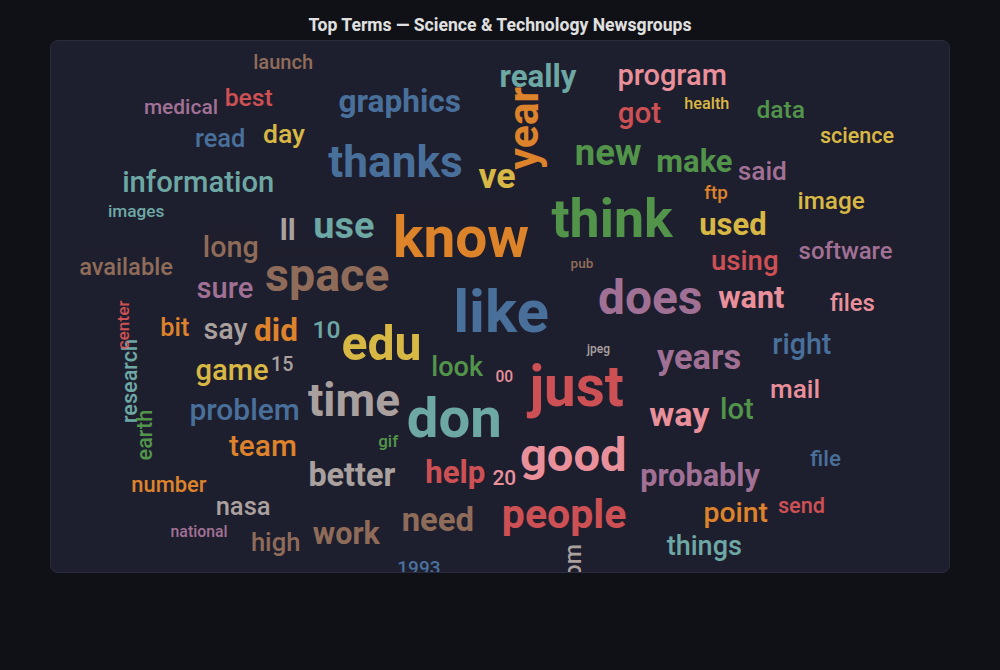

```python
from endgame.visualization import WordCloudVisualizer

# NLP vocabulary from 20newsgroups (science & technology topics)
from sklearn.datasets import fetch_20newsgroups
from sklearn.feature_extraction.text import TfidfVectorizer
news = fetch_20newsgroups(
    subset='train',
    categories=['sci.space', 'sci.med', 'comp.graphics', 'rec.sport.baseball'],
    remove=('headers', 'footers', 'quotes'),
)
tfidf = TfidfVectorizer(max_features=80, stop_words='english', min_df=5)
tfidf_matrix = tfidf.fit_transform(news.data)
words = tfidf.get_feature_names_out()
weights = np.array(tfidf_matrix.mean(axis=0)).flatten()
viz = WordCloudVisualizer(
    words={w: float(s) for w, s in zip(words, weights)},
    max_words=80,
    title="Top Terms — Science & Technology Newsgroups",
)
viz.save("nlp_wordcloud.html")

# Or from feature names (simpler)
viz = WordCloudVisualizer.from_feature_names(fn_bc, rf_bc.feature_importances_)
viz.save("feature_wordcloud.html")
```

---

## Extended Charts (Tier 4)

### Arc Diagram

**What:** Nodes on a line connected by arcs whose thickness maps to weight.

**When to use:** Visualizing pairwise feature correlations, model similarity matrices, co-occurrence patterns.

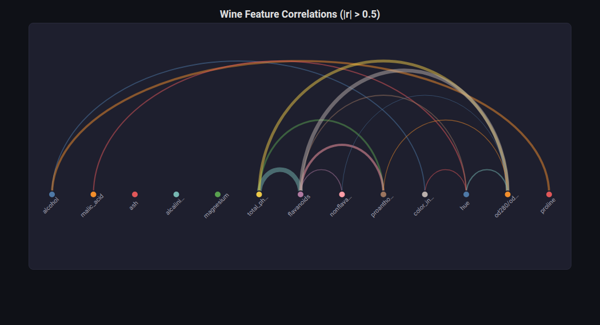

```python
from endgame.visualization import ArcDiagramVisualizer

# Wine — 13 features with interesting correlations
corr = np.corrcoef(X_wn.T)
viz = ArcDiagramVisualizer.from_correlation_matrix(
    corr, fn_wn, threshold=0.5,
    title="Wine Feature Correlations (|r| > 0.5)",
)
viz.save("feature_arcs.html")
```

---

### Chord Diagram

**What:** Circular layout showing pairwise relationships with ribbons connecting arcs.

**When to use:** Misclassification flow between classes, feature co-importance, migration/transition matrices.

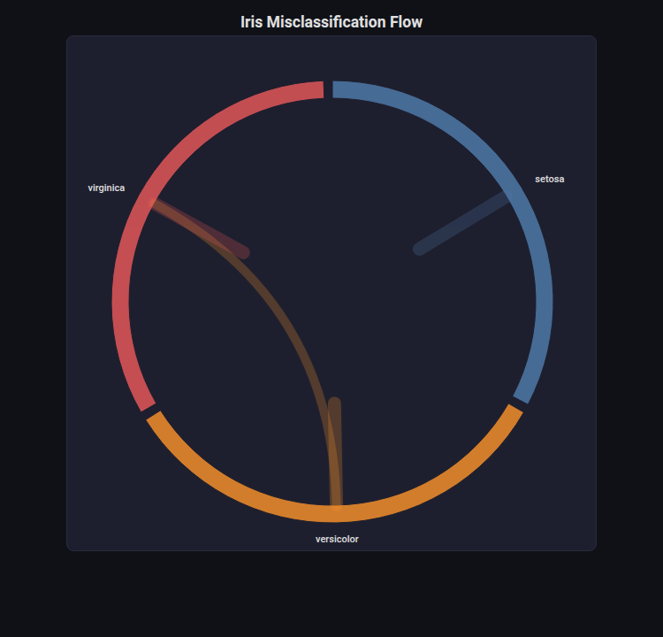

```python
from endgame.visualization import ChordDiagramVisualizer

# Iris — 3-class misclassification flow
cm = confusion_matrix(y_ir_te, rf_ir.predict(X_ir_te))
viz = ChordDiagramVisualizer.from_confusion_matrix(
    cm, cn_ir, title="Iris Misclassification Flow",
)
viz.save("confusion_chord.html")
```

---

### Donut Chart

**What:** Pie chart with a hole in the center for text. Configurable inner radius (0 = pie).

**When to use:** Class distribution, ensemble weight composition, any simple proportional breakdown.

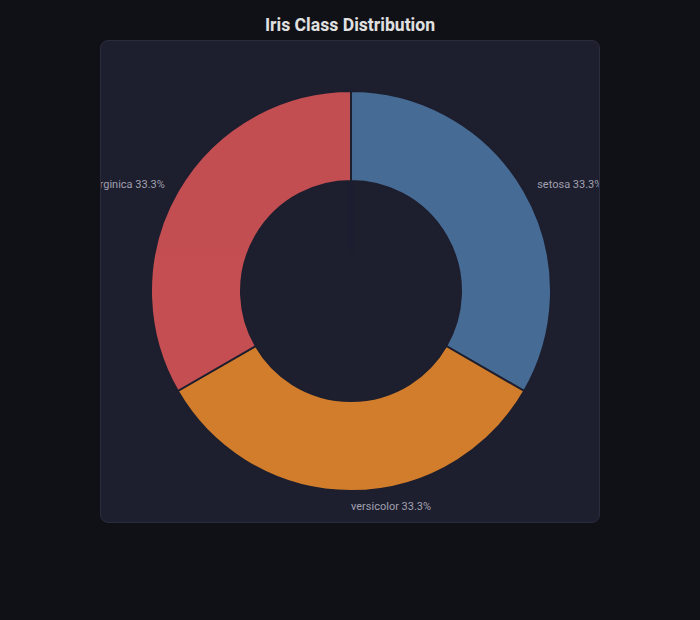

```python
from endgame.visualization import DonutChartVisualizer

# Iris — 3 balanced classes
unique, counts = np.unique(y_ir, return_counts=True)
viz = DonutChartVisualizer(
    labels=[cn_ir[i] for i in unique],
    values=counts.tolist(),
    title="Iris Class Distribution",
)
viz.save("class_donut.html")
```

---

### Flow Chart

**What:** Directed process diagram with typed nodes (input, process, decision, output) and labeled edges.

**When to use:** Documenting ML pipelines, data preprocessing flows, model selection decision trees.

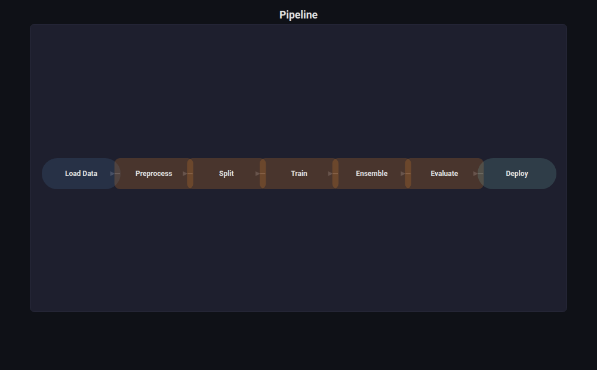

```python
from endgame.visualization import FlowChartVisualizer

# Typical ML pipeline
viz = FlowChartVisualizer.from_pipeline([
    ("Load Data", "sklearn.load_iris()"),
    ("Preprocess", "StandardScaler + PCA"),
    ("Split", "70/30 stratified"),
    ("Train", "RandomForest, SVM, GB"),
    ("Ensemble", "Hill Climbing"),
    ("Evaluate", "ROC, PR, Confusion Matrix"),
    ("Deploy", "ONNX export"),
])
viz.save("pipeline_flow.html")
```

---

### Network Diagram

**What:** Node-link graph with force-directed, hierarchical, or circular layout. Special support for Bayesian Networks.

**When to use:** Visualizing Bayesian network structure (TAN/KDB/ESKDB), feature dependency graphs, any DAG or graph structure.

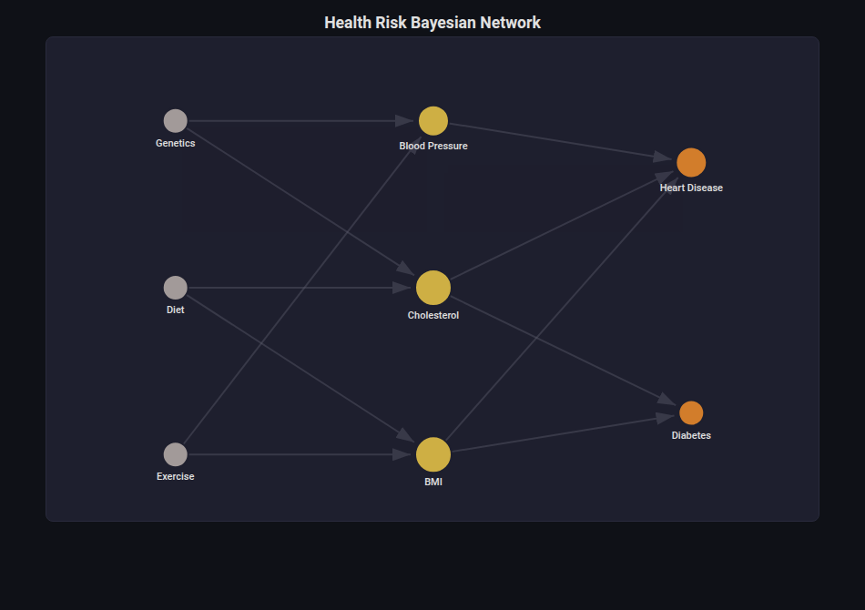

```python
from endgame.visualization import NetworkDiagramVisualizer

# Synthetic health risk Bayesian network
viz = NetworkDiagramVisualizer(
    nodes=[
        {"id": "Genetics", "label": "Genetics", "group": "cause"},
        {"id": "Diet", "label": "Diet", "group": "cause"},
        {"id": "Exercise", "label": "Exercise", "group": "cause"},
        {"id": "Blood Pressure", "label": "Blood Pressure", "group": "intermediate"},
        {"id": "Cholesterol", "label": "Cholesterol", "group": "intermediate"},
        {"id": "BMI", "label": "BMI", "group": "intermediate"},
        {"id": "Heart Disease", "label": "Heart Disease", "group": "outcome"},
        {"id": "Diabetes", "label": "Diabetes", "group": "outcome"},
    ],
    edges=[
        ("Genetics", "Blood Pressure"), ("Genetics", "Cholesterol"),
        ("Diet", "Cholesterol"), ("Diet", "BMI"),
        ("Exercise", "BMI"), ("Exercise", "Blood Pressure"),
        ("Blood Pressure", "Heart Disease"), ("Cholesterol", "Heart Disease"),
        ("BMI", "Diabetes"), ("BMI", "Heart Disease"),
        ("Cholesterol", "Diabetes"),
    ],
    directed=True, layout="hierarchical",
    title="Health Risk Bayesian Network",
)
viz.save("dependency_network.html")

# From a fitted Bayesian classifier (endgame models)
# viz = NetworkDiagramVisualizer.from_bayesian_network(tan_model, feature_names=fn_bc)
```

---

### Nightingale Rose

**What:** Polar area chart where each sector has equal angle but radius encodes magnitude.

**When to use:** Comparing metrics across categories in a visually striking way. Alternative to bar charts when categories are cyclical or you want a compact layout.

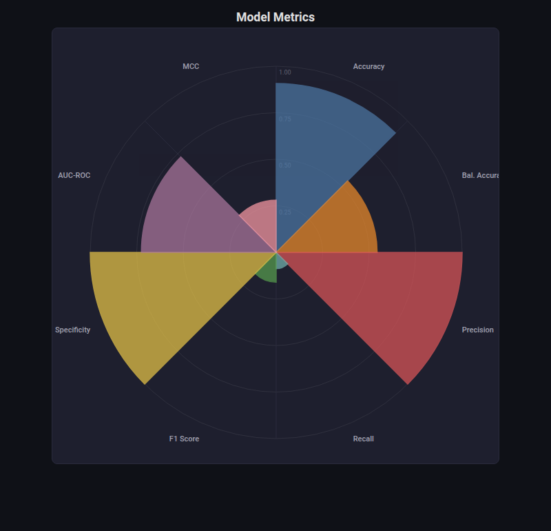

```python
from endgame.visualization import NightingaleRoseVisualizer

# Imbalanced dataset — dramatic metric variation reveals model weaknesses
y_imb_pred = rf_imb.predict(X_imb_te)
y_imb_proba = rf_imb.predict_proba(X_imb_te)[:, 1]
tn = int(((y_imb_te == 0) & (y_imb_pred == 0)).sum())
fp = int(((y_imb_te == 0) & (y_imb_pred == 1)).sum())
viz = NightingaleRoseVisualizer.from_metrics({
    "Accuracy": round(accuracy_score(y_imb_te, y_imb_pred), 3),
    "Bal. Accuracy": round(balanced_accuracy_score(y_imb_te, y_imb_pred), 3),
    "Precision": round(precision_score(y_imb_te, y_imb_pred, zero_division=0), 3),
    "Recall": round(recall_score(y_imb_te, y_imb_pred), 3),
    "F1 Score": round(f1_score(y_imb_te, y_imb_pred), 3),
    "Specificity": round(tn / max(tn + fp, 1), 3),
    "AUC-ROC": round(roc_auc_score(y_imb_te, y_imb_proba), 3),
    "MCC": round(max(0, matthews_corrcoef(y_imb_te, y_imb_pred)), 3),
})
viz.save("metrics_rose.html")
```

---

### Radial Bar

**What:** Bars extending outward from a center point in a circular layout.

**When to use:** Compact display of ranked values (feature importances, model scores) when you have many categories.

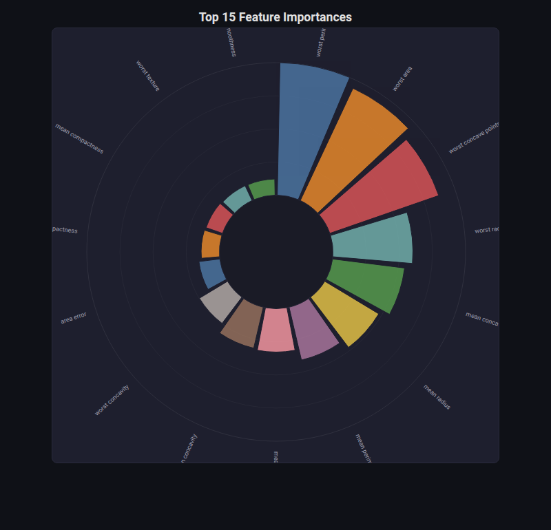

```python
from endgame.visualization import RadialBarVisualizer

# Breast cancer — top 15 features (of 30)
top_idx = np.argsort(rf_bc.feature_importances_)[::-1][:15]
viz = RadialBarVisualizer(
    labels=[fn_bc[i] for i in top_idx],
    values=[float(rf_bc.feature_importances_[i]) for i in top_idx],
    sort=True,
    title="Top 15 Feature Importances",
)
viz.save("radial_importances.html")
```

---

### Spiral Plot

**What:** Data plotted along an Archimedean spiral, with color/size encoding values.

**When to use:** Sequential or time-series data with periodicity. Compact display of long sequences (e.g., daily model performance over a year).

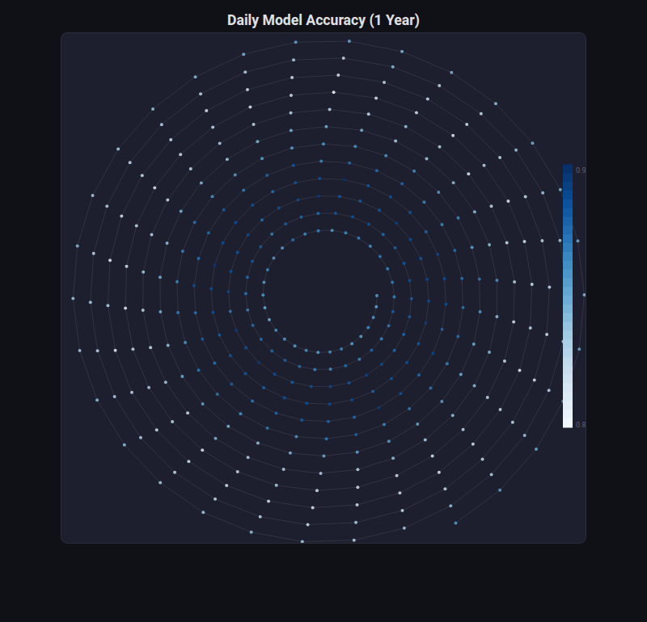

```python
from endgame.visualization import SpiralPlotVisualizer

# Synthetic seasonal model accuracy — 365 days with periodic pattern
np.random.seed(42)
days = np.arange(365)
seasonal = 0.92 + 0.03 * np.sin(2 * np.pi * days / 365) + np.random.randn(365) * 0.005
seasonal = np.clip(seasonal, 0.85, 0.98)
viz = SpiralPlotVisualizer.from_time_series(seasonal, title="Daily Model Accuracy (1 Year)")
viz.save("accuracy_spiral.html")
```

---

### Stream Graph

**What:** Stacked area chart with smooth curves, centered or zero-baseline.

**When to use:** Evolution of model ensemble weights over time, feature importance trends across boosting rounds, topic prevalence over time.

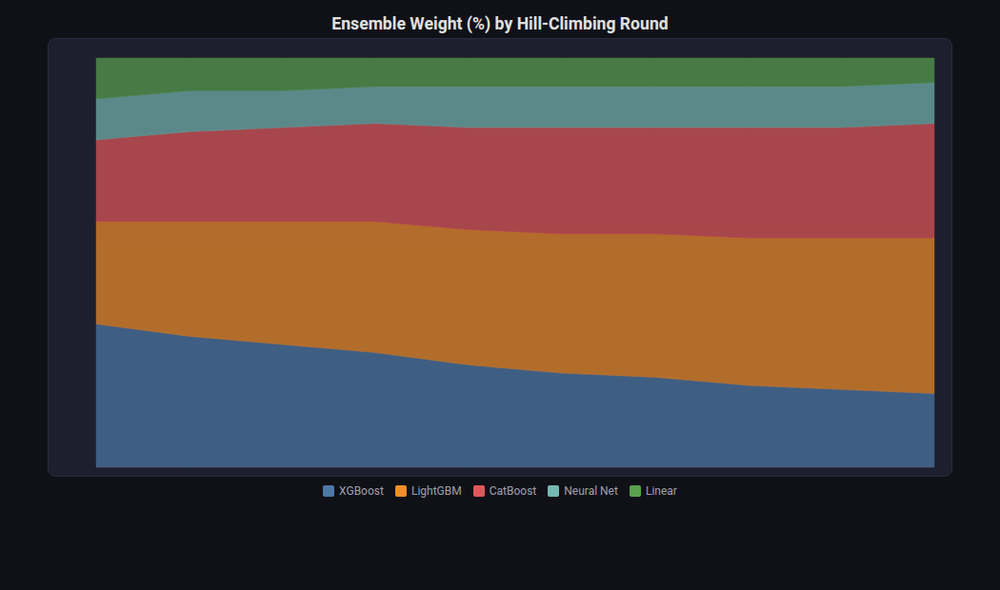

```python
from endgame.visualization import StreamGraphVisualizer

# Ensemble weight (%) evolution over 10 hill-climbing rounds
viz = StreamGraphVisualizer(
    x=[f"Round {i}" for i in range(1, 11)],
    series={
        "XGBoost":     [35, 32, 30, 28, 25, 23, 22, 20, 19, 18],
        "LightGBM":    [25, 28, 30, 32, 33, 34, 35, 36, 37, 38],
        "CatBoost":    [20, 22, 23, 24, 25, 26, 26, 27, 27, 28],
        "Neural Net":  [10, 10, 9, 9, 10, 10, 10, 10, 10, 10],
        "Linear":      [10, 8, 8, 7, 7, 7, 7, 7, 7, 6],
    },
    baseline="center",
    title="Ensemble Weight (%) by Hill-Climbing Round",
)
viz.save("ensemble_stream.html")
```

---

## General-Purpose Charts (Tier B)

### Ridgeline (Joy) Plot

**What:** Vertically stacked, overlapping KDE density curves with quantile markers.

**When to use:** Comparing distributions across 5-20 groups: CV folds, model variants, feature distributions by class. More expressive than box plots.

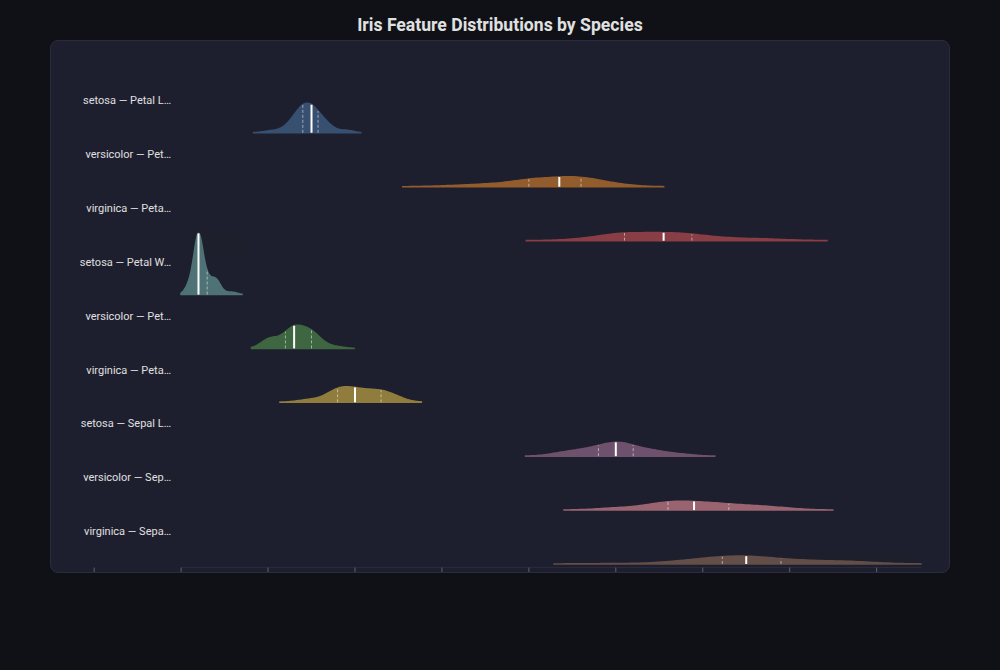

```python
from endgame.visualization import RidgelinePlotVisualizer

# Iris features by species — shows separation (petal) vs overlap (sepal)
ridgeline_data = {}
for fi, fname in [(2, "Petal Length"), (3, "Petal Width"), (0, "Sepal Length")]:
    for ci, cname in enumerate(cn_ir):
        ridgeline_data[f"{cname} — {fname}"] = X_ir[y_ir == ci, fi].tolist()
viz = RidgelinePlotVisualizer(
    ridgeline_data, title="Iris Feature Distributions by Species",
)
viz.save("iris_ridgeline.html")
```

---

### Bump Chart

**What:** Ranking positions connected by smooth curves showing how rankings change across time points.

**When to use:** Tracking model leaderboard positions across experiments, fold rankings, or temporal performance shifts.

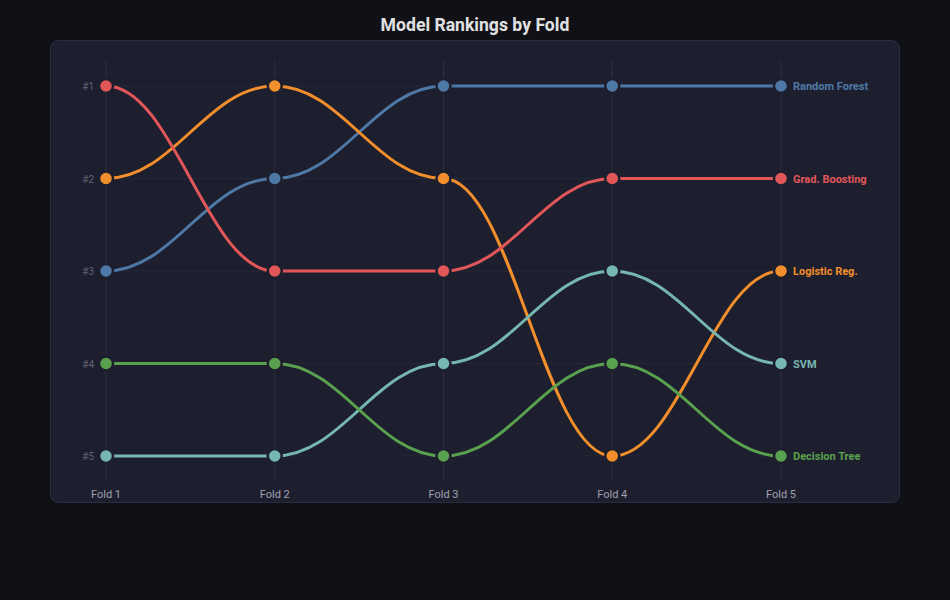

```python
from endgame.visualization import BumpChartVisualizer

# 5-model ranking across 5 CV folds on breast cancer
cv_5fold = {
    "Random Forest": cross_val_score(rf_bc, X_bc, y_bc, cv=5, scoring="accuracy").tolist(),
    "Logistic Reg.": cross_val_score(lr_bc, X_bc, y_bc, cv=5, scoring="accuracy").tolist(),
    "Grad. Boosting": cross_val_score(gb_bc, X_bc, y_bc, cv=5, scoring="accuracy").tolist(),
    "SVM": cross_val_score(svm_bc, X_bc, y_bc, cv=5, scoring="accuracy").tolist(),
    "Decision Tree": cross_val_score(
        DecisionTreeClassifier(max_depth=5, random_state=42),
        X_bc, y_bc, cv=5, scoring="accuracy",
    ).tolist(),
}
viz = BumpChartVisualizer.from_cv_scores(cv_5fold)
viz.save("ranking_bump.html")
```

---

### Lollipop Chart

**What:** Dots on stems — a cleaner, less cluttered alternative to bar charts.

**When to use:** Feature importances (especially with many features), any ranked list where the exact value matters more than the bar area.

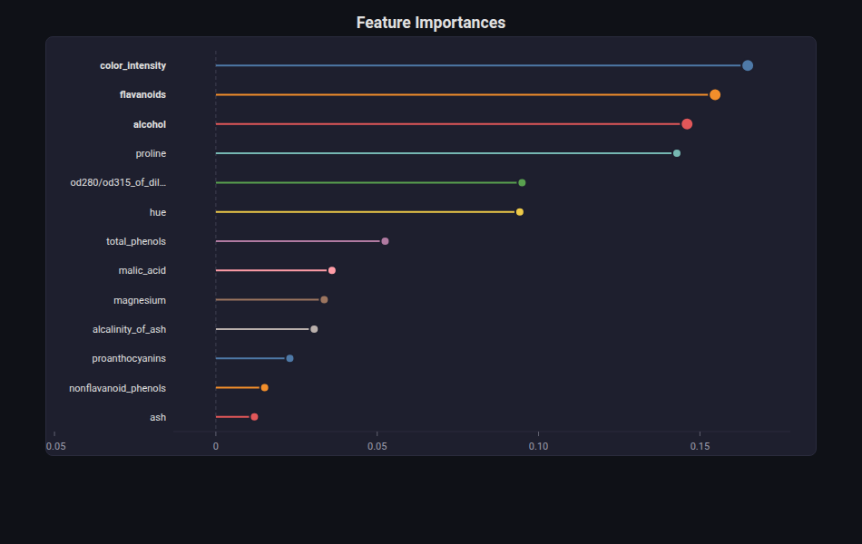

```python
from endgame.visualization import LollipopChartVisualizer

# Wine — 13 well-named features
viz = LollipopChartVisualizer.from_importances(rf_wn, feature_names=fn_wn, top_n=13)
viz.save("importance_lollipop.html")
```

---

### Dumbbell Chart

**What:** Two dots per row connected by a line — shows paired comparisons (before/after, train/test).

**When to use:** Before vs after hyperparameter tuning. Train vs test metrics (detecting overfitting). Baseline vs improved model.

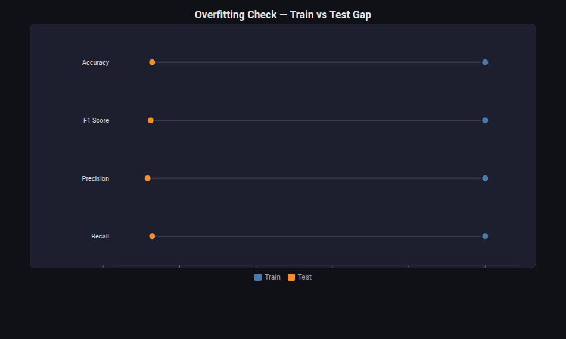

```python
from endgame.visualization import DumbbellChartVisualizer

# Overfitting model on hard dataset — dramatic train/test gap
rf_overfit = RandomForestClassifier(
    n_estimators=500, max_depth=None, min_samples_leaf=1, random_state=42,
).fit(X_hard_tr, y_hard_tr)
y_tr_pred = rf_overfit.predict(X_hard_tr)
y_te_pred = rf_overfit.predict(X_hard_te)
labels = ["Accuracy", "F1 Score", "Precision", "Recall"]
train_vals = [accuracy_score(y_hard_tr, y_tr_pred), f1_score(y_hard_tr, y_tr_pred),
              precision_score(y_hard_tr, y_tr_pred), recall_score(y_hard_tr, y_tr_pred)]
test_vals = [accuracy_score(y_hard_te, y_te_pred), f1_score(y_hard_te, y_te_pred),
             precision_score(y_hard_te, y_te_pred), recall_score(y_hard_te, y_te_pred)]
viz = DumbbellChartVisualizer(
    labels=labels,
    values_start=train_vals, values_end=test_vals,
    start_label="Train", end_label="Test",
    title="Overfitting Check — Train vs Test Gap",
)
viz.save("model_dumbbell.html")
```

---

### Funnel Chart

**What:** Progressively narrowing trapezoids showing attrition through stages.

**When to use:** Data pipeline sample counts (raw -> cleaned -> featured -> trained), feature selection cascade, any multi-step reduction process.

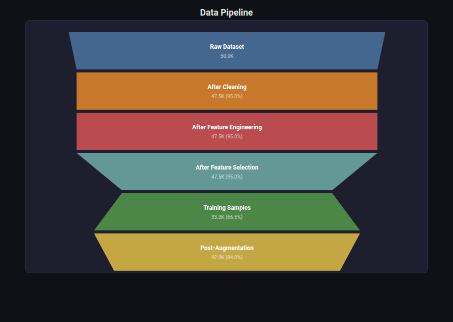

```python
from endgame.visualization import FunnelChartVisualizer

# Realistic ML pipeline attrition
viz = FunnelChartVisualizer.from_pipeline(
    stages=["Raw Dataset", "After Cleaning", "After Feature Engineering",
            "After Feature Selection", "Training Samples", "Post-Augmentation"],
    sample_counts=[50000, 47500, 47500, 47500, 33250, 42000],
)
viz.save("data_pipeline_funnel.html")

# Feature selection funnel
viz = FunnelChartVisualizer.from_feature_selection(
    stages=["All Features", "Variance > 0.01", "Correlation < 0.95", "RFE Top 10"],
    feature_counts=[20, 18, 14, 10],
)
viz.save("feature_selection_funnel.html")
```

---

### Gauge Chart

**What:** Speedometer dial with a needle pointing to a single metric value. Colored zones indicate quality ranges.

**When to use:** Dashboard KPI display — show a single headline metric (accuracy, AUC, F1) with immediate visual context of whether it's good/bad.

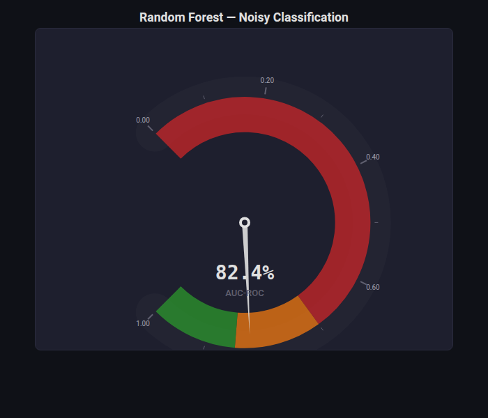

```python
from endgame.visualization import GaugeChartVisualizer

# Hard dataset AUC — moderate value shows all gauge zones
hard_auc = roc_auc_score(y_hard_te, rf_hard.predict_proba(X_hard_te)[:, 1])
viz = GaugeChartVisualizer(
    value=round(hard_auc, 4), label="AUC-ROC",
    zones=[(0, 0.7, "#d62728"), (0.7, 0.85, "#ff7f0e"), (0.85, 1.0, "#2ca02c")],
    format_str=".1%",
    title="Random Forest — Noisy Classification",
)
viz.save("auc_gauge.html")
```

---

## Decision Tree

### Tree Visualizer

**What:** Interactive decision tree visualization with expand/collapse nodes, color-coded by class or value.

**When to use:** Interpreting decision tree models, explaining tree-based rules, debugging shallow trees.

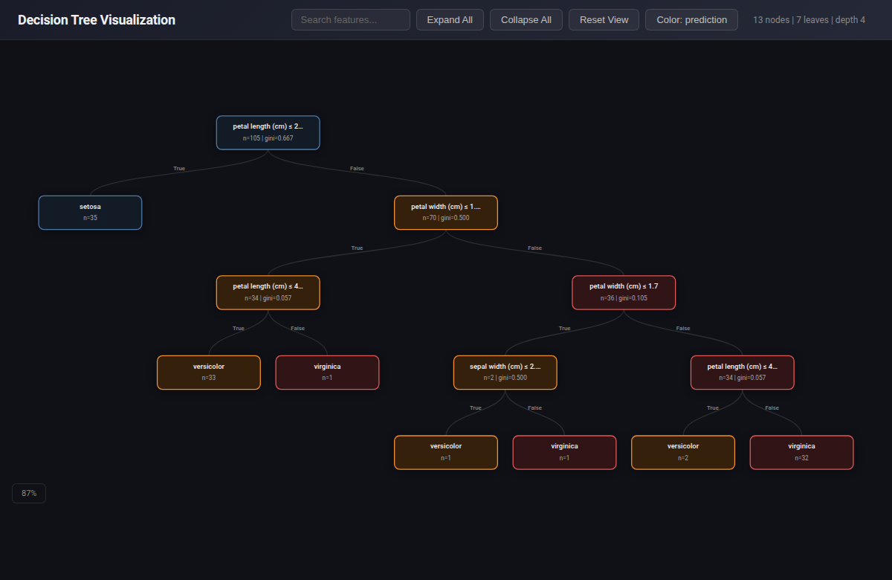

```python
from endgame.visualization import TreeVisualizer

# Iris — depth-4 tree with 3 color-coded classes
viz = TreeVisualizer(dt_ir, feature_names=fn_ir, class_names=cn_ir)
viz.save("decision_tree.html")
```

---

## Quick Reference

| Chart | Class | Best Classmethod | Primary ML Use |
|-------|-------|-----------------|----------------|
| ROC Curve | `ROCCurveVisualizer` | `from_estimator` | Classification threshold analysis |
| PR Curve | `PRCurveVisualizer` | `from_estimator` | Imbalanced classification |
| Calibration | `CalibrationPlotVisualizer` | `from_estimator` | Probability quality |
| Lift/Gains | `LiftChartVisualizer` | `from_estimator` | Ranking quality |
| PDP/ICE | `PDPVisualizer` | `from_estimator` | Feature effects |
| PDP 2D | `PDP2DVisualizer` | `from_estimator` | Feature interactions |
| Waterfall | `WaterfallVisualizer` | `from_shap` | Individual prediction explanation |
| Bar | `BarChartVisualizer` | `from_importances` | Feature importance |
| Heatmap | `HeatmapVisualizer` | `from_correlation` | Correlation analysis |
| Confusion Matrix | `ConfusionMatrixVisualizer` | `from_estimator` | Classification errors |
| Histogram | `HistogramVisualizer` | `from_residuals` | Distribution analysis |
| Line | `LineChartVisualizer` | `from_learning_curve` | Training curves |
| Scatter | `ScatterplotVisualizer` | `from_predictions` | Predicted vs actual |
| Box Plot | `BoxPlotVisualizer` | `from_cv_results` | Score distributions |
| Violin | `ViolinPlotVisualizer` | — | Dense distributions |
| Error Bars | `ErrorBarsVisualizer` | `from_cv_results` | Confidence intervals |
| Parallel Coords | `ParallelCoordinatesVisualizer` | `from_optuna_study` | Hyperparameter search |
| Radar | `RadarChartVisualizer` | `from_metrics` | Multi-metric comparison |
| Treemap | `TreemapVisualizer` | `from_importances` | Proportional importance |
| Sunburst | `SunburstVisualizer` | — | Hierarchical breakdown |
| Sankey | `SankeyVisualizer` | — | Prediction flow |
| Dot Matrix | `DotMatrixVisualizer` | — | Proportional display |
| Venn | `VennDiagramVisualizer` | — | Model agreement |
| Word Cloud | `WordCloudVisualizer` | `from_feature_names` | Feature name display |
| Arc Diagram | `ArcDiagramVisualizer` | `from_correlation_matrix` | Pairwise relationships |
| Chord | `ChordDiagramVisualizer` | `from_confusion_matrix` | Misclassification flow |
| Donut | `DonutChartVisualizer` | `from_class_distribution` | Class balance |
| Flow Chart | `FlowChartVisualizer` | `from_pipeline` | Pipeline documentation |
| Network | `NetworkDiagramVisualizer` | `from_bayesian_network` | Graph structure |
| Nightingale Rose | `NightingaleRoseVisualizer` | `from_metrics` | Metric comparison |
| Radial Bar | `RadialBarVisualizer` | — | Compact ranked display |
| Spiral | `SpiralPlotVisualizer` | `from_time_series` | Periodic/sequential data |
| Stream Graph | `StreamGraphVisualizer` | — | Temporal composition |
| Ridgeline | `RidgelinePlotVisualizer` | `from_cv_results` | Distribution comparison |
| Bump | `BumpChartVisualizer` | `from_cv_scores` | Ranking evolution |
| Lollipop | `LollipopChartVisualizer` | `from_importances` | Clean feature ranking |
| Dumbbell | `DumbbellChartVisualizer` | `from_train_test` | Before/after comparison |
| Funnel | `FunnelChartVisualizer` | `from_pipeline` | Pipeline attrition |
| Gauge | `GaugeChartVisualizer` | `from_accuracy` | Single metric display |
| Decision Tree | `TreeVisualizer` | — | Tree interpretation |

---

## Theming

All charts support `theme="dark"` (default) or `theme="light"`:

```python
viz = BarChartVisualizer.from_dict({"A": 1, "B": 2}, theme="light")
```

## Palettes

Available categorical palettes: `tableau` (default), `d3`, `pastel`, `bold`, `muted`.

```python
from endgame.visualization import get_palette

colors = get_palette("tableau", n=5)  # get 5 colors
viz = BarChartVisualizer(labels=["A", "B"], values=[1, 2], palette="d3")
```
